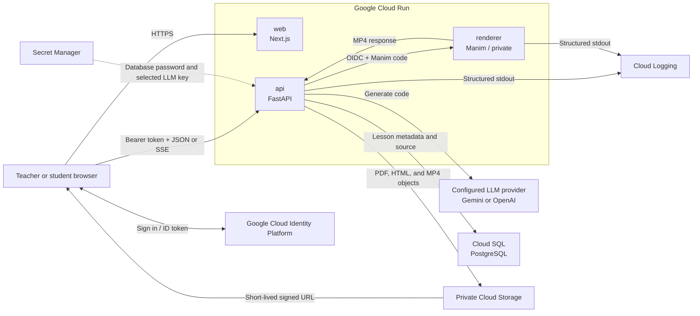

# Chalksmith

[](https://nextjs.org/)
[](https://fastapi.tiangolo.com/)
[](https://opensource.org/licenses/MIT)

[*Chalksmith*](https://chalksmith.ai) is an AI-driven tool for generating code-driven educational STEM animations from natural language. Generate and **edit** lessons through simple prompts, balancing speed and **AI-transparency**.

Supported, exportable formats include:
* Interactive display (p5.js library)
* Presentation (reveal.js library)
* Video (Manim library)

*Disclaimer:* This website is currently in the beta-testing stage, feel free the reach out with any errors.

## Examples

### Video Walkthrough
<div align="center">
  <video src="https://github.com/user-attachments/assets/be35e3f2-7c95-4cef-80a8-daf3e694acc8" width="100%" controls>
    Your browser does not support the video tag.
  </video>
</div>

### Lesson Examples
[**Examples**](https://chalksmith.ai/#examples)

### Sample Topics
* Fractions, Percentages, and Decimals
* Linear Equations
* The Pythagorean Theorem
* Experimental vs. Theoretical Probability
* Phases of the Moon
* Light Reflection and Refraction
* Heat Transfer via Convection
* States of Matter
* Bohr Model of the Atom (Protons, Neutrons, Electrons)
* Law of Conservation of Mass
* Photosynthesis Inputs and Outputs
* Food Web Energy Pyramid
* Natural Selection

## Motivation
Did you know **teachers** spend up to **12 hours** per week on lessons?—5 hours collecting resources, 7 hours building them from scratch. As a high schooler attending an international school with a highly diverse student body, I acutely perceived this issue, especially in STEM subjects where prior experience differed drastically.

From this issue emerged the incentive to create a solution. Over these past few months, I learned how to code, design, and deploy websites, and tested my website with over **50+ students and teachers** across K12 grades.

## Tech Stack

| Layer | Technology | Purpose |
| :--- | :--- | :--- |
| **Frontend** | Next.js 16, React 19, TypeScript | User interface, Identity Platform session, direct API client |
| **API** | Python 3.12, FastAPI, SQLModel | Authenticated lesson API and generation orchestration |
| **Renderer** | FastAPI, Manim | Isolated execution of generated video code |
| **Database** | Cloud SQL for PostgreSQL | Lesson metadata and source code |
| **Storage** | Private Cloud Storage | PDF sources, HTML outputs, and MP4 outputs |
| **Authentication** | Google Cloud Identity Platform | Google, Microsoft, and managed email/password login |
| **LLM** | Gemini Developer API or OpenAI Responses API | Deployment-configured, interchangeable provider |
| **Runtime** | Cloud Run, Cloud Build, Artifact Registry | Three independently scalable containers |

## Code Architecture

The repository contains two independent application runtimes. Node.js commands are scoped to `frontend/`; Python commands are scoped to `backend/` through uv. There is no root npm workspace and no Next.js API proxy layer.

```text
.
├── frontend/
│   ├── public/                  # Static marketing and example assets
│   ├── src/app/                 # Next.js App Router pages and layouts
│   ├── src/components/          # Auth, dashboard, generation, home, and UI components
│   └── src/lib/
│       ├── api/                 # Bearer-token FastAPI client and SSE parser
│       ├── firebase/            # Identity Platform browser initialization
│       ├── hooks/               # Authenticated API and generation state hooks
│       └── types/               # Shared frontend API types
├── backend/
│   ├── app/main.py              # Public FastAPI application
│   ├── app/renderer_main.py     # Private Manim renderer application
│   ├── app/api/                 # HTTP routes, validation, dependencies, and SSE
│   ├── app/core/                # Configuration, errors, and structured logging
│   ├── app/db/                  # SQLModel models, sessions, and tenant-safe queries
│   ├── app/integrations/        # Identity, GCS, Gemini, and OpenAI adapters
│   ├── app/renderers/           # HTML validation and remote/local Manim boundaries
│   ├── app/services/            # Generation, prompts, and PDF extraction
│   ├── scripts/                 # Schema initialization and v1 migration
│   └── tests/                   # Backend unit and API tests
└── infra/
    ├── docker/                  # Web, API, and renderer images
    └── gcloud/                  # Cloud Build, lifecycle, and deployment automation
```

The frontend owns presentation and browser session state. It retrieves an Identity Platform ID token and calls FastAPI directly through the clients in `frontend/src/lib/api/`.

The API owns authentication, authorization, generation orchestration, database writes, object storage, and signed access URLs. HTTP handlers remain thin: generation rules live in `services/`, external vendors remain behind `integrations/`, and every lesson query includes the authenticated Identity Platform `uid` as `owner_id`.

The renderer shares backend validation code but has a separate entry point and container. Only `renderer_main.py` executes generated Manim Python. The public API container does not install Manim and cannot fall back to local code execution.

## System Architecture

Production runs three Cloud Run services: a public Next.js web service, a public-network FastAPI service whose application routes require Identity Platform tokens, and a private Manim renderer callable only by the API service account.



A generation request follows one path:

1. The browser sends `POST /v2/generations` with an ID token, lesson parameters, and optional PDFs.
2. FastAPI verifies the token, enforces file and request limits, extracts PDF text, and streams progress over SSE.
3. The configured LLM adapter returns a summary and source code.
4. Interactive p5.js and Reveal.js outputs are validated and secured as HTML inside the API without being executed there. Video code is sent to the isolated renderer over an authenticated service-to-service request.
5. The API uploads the final artifact to private Cloud Storage and stores lesson metadata and source code in Cloud SQL.
6. Preview and download requests return short-lived signed URLs; the database stores stable object keys, never expiring URLs.

The renderer has no Cloud SQL, GCS, Secret Manager, or LLM permissions. The complete API contract, security rationale, migration plan, and implementation decisions are in [REFACTOR.md](REFACTOR.md).

---

## Local Development and Debugging

### Prerequisites

Install the following tools:

- Git, Node.js 24+, and npm.
- [uv](https://docs.astral.sh/uv/); uv installs the pinned Python 3.12 runtime and manages `backend/.venv`.
- A Google Cloud project with Identity Platform configured and a private development GCS bucket for complete authenticated generation tests.
- A key and valid model ID for either Gemini Developer API or OpenAI.
- Manim's operating-system dependencies for video generation. The renderer image installs Cairo, Pango, FFmpeg, build tools, and `pkg-config`; see the [Manim installation guide](https://docs.manim.community/en/stable/installation.html) for the equivalent host setup.

The marketing pages, frontend build, health checks, and unit tests can run without live cloud services. Signing in and generating lessons require real Identity Platform, LLM, and GCS configuration.

### 1. Clone and install

```bash
git clone https://github.com/avarzhou-ctrl/Chalksmith.ai.git
cd Chalksmith.ai
npm --prefix frontend ci
uv sync --project backend --extra video
```

`--extra video` installs Manim for the renderer process. The API Docker image deliberately omits this extra in production.

### 2. Configure the environment

Copy the committed templates:

```bash
cp frontend/.env.example frontend/.env.local
cp backend/.env.example backend/.env.local
```

Set the public Identity Platform browser configuration and local API URL in `frontend/.env.local`:

```bash
NEXT_PUBLIC_FIREBASE_API_KEY=your-public-browser-api-key
NEXT_PUBLIC_FIREBASE_AUTH_DOMAIN=your-project.firebaseapp.com
NEXT_PUBLIC_FIREBASE_PROJECT_ID=your-project-id
NEXT_PUBLIC_FIREBASE_APP_ID=your-public-browser-app-id
NEXT_PUBLIC_API_URL=http://localhost:8000
```

Add `localhost` to Identity Platform's authorized domains and enable the login providers you want to test. These `NEXT_PUBLIC_*` values are browser configuration, not server secrets.

Configure `backend/.env.local` for the selected provider and development resources:

```bash
APP_ENV=local
APP_ROLE=api
FRONTEND_ORIGINS=http://localhost:3000
GCP_PROJECT_ID=your-project-id
IDENTITY_PLATFORM_PROJECT_ID=your-project-id

LLM_PROVIDER=gemini
LLM_MODEL=your-provider-model-id
GEMINI_API_KEY=your-server-side-key

DATABASE_URL=sqlite:///./backend/chalksmith.local.db
GCS_BUCKET=your-private-development-bucket
GCS_SIGNER_SERVICE_ACCOUNT=chalksmith-api@your-project-id.iam.gserviceaccount.com
MANIM_RENDERER_URL=http://localhost:8081
```

For OpenAI, set `LLM_PROVIDER=openai`, provide an OpenAI model ID and `OPENAI_API_KEY`, and leave `GEMINI_API_KEY` empty. Only the selected provider key is required.

The local database defaults to SQLite and is created automatically. Full generation uses a real private GCS bucket. Authenticate Google client libraries with Application Default Credentials rather than downloading a key into the repository:

```bash
gcloud auth application-default login
```

The local ADC principal needs permission to upload and delete objects in the development bucket. The signer service account needs read access to those objects, and the local principal must be allowed to impersonate it to generate V4 signed URLs. Never commit credentials or `.env.local` files.

### 3. Start the three processes

Run every command from the repository root in a separate terminal.

Terminal 1 — private renderer equivalent on port 8081:

```bash
uv run --project backend uvicorn backend.app.renderer_main:renderer_app --reload --port 8081
```

Terminal 2 — public API on port 8000:

```bash
uv run --project backend uvicorn backend.app.main:app --reload --port 8000
```

Terminal 3 — Next.js on port 3000:

```bash
npm --prefix frontend run dev
```

The API never executes Manim locally. If the renderer process is not running, interactive and slide generation can still work, but video generation returns a renderer-unavailable error.

### 4. Verify and debug

Useful local endpoints:

| URL | Purpose |
| :--- | :--- |
| `http://localhost:3000` | Web application |
| `http://localhost:8000/docs` | FastAPI OpenAPI explorer |
| `http://localhost:8000/healthz` | API health check |
| `http://localhost:8081/healthz` | Renderer health check |

Quick health checks:

```bash
curl http://localhost:8000/healthz
curl http://localhost:8081/healthz
```

The API and renderer write structured logs to their terminals. API responses also include `X-Request-ID`; use that value to match a browser failure with its request and generation-stage logs.

Common failure points:

| Symptom | Check |
| :--- | :--- |
| Frontend reports missing Firebase configuration | Confirm all four `NEXT_PUBLIC_FIREBASE_*` values, then restart Next.js |
| Sign-in works but API returns `401` or identity verification fails | Confirm both sides use the same Identity Platform project and local ADC is valid |
| Browser reports a CORS error | Confirm `FRONTEND_ORIGINS` exactly contains `http://localhost:3000` |
| Generation returns `llm_not_configured` | Confirm `LLM_PROVIDER`, `LLM_MODEL`, and only the selected provider key |
| Generation returns `storage_not_configured` or preview signing fails | Confirm `GCS_BUCKET`, bucket IAM, signer service account, and impersonation permission |
| Video generation cannot render | Confirm port 8081, `MANIM_RENDERER_URL`, Manim system packages, and renderer terminal logs |

Run all repository checks before opening a pull request:

```bash
uv lock --project backend --check
uv run --project backend python -m unittest discover -s backend/tests
npm --prefix frontend run typecheck
npm --prefix frontend run build
bash -n infra/gcloud/deploy.sh
git diff --check
```

## Google Cloud Deployment

The supported production path is Cloud Build plus three Cloud Run services. The repository does not use Vercel, a VPS launcher, or a persistent local `backend/static/` directory. The deployment script has no dry-run mode: it creates or updates live resources and IAM policies, so review its defaults and use a non-production project for the first run.

### 1. Prepare the project

Before running the deployment script:

1. Select a billing-enabled Google Cloud project and authenticate `gcloud` with an account that can enable APIs and manage IAM, Cloud Run, Cloud SQL, Cloud Storage, Secret Manager, Artifact Registry, and Cloud Build.
2. Upgrade authentication to Identity Platform. Enable Google, Microsoft, and/or Email/Password as needed. Configure the Microsoft client ID and secret, provider redirect URI, and every production web hostname as an authorized domain.
3. Create Secret Manager secrets containing the Cloud SQL user password and the selected LLM provider API key. The script expects existing secret names and grants only the API service account access to them.
4. Choose a valid `LLM_PROVIDER` (`gemini` or `openai`) and a compatible `LLM_MODEL`.
5. Install the Google Cloud CLI and authenticate:

```bash
gcloud auth login
gcloud config set project your-project-id
```

### 2. Deploy the services

From the repository root, export the required deployment values:

```bash
export PROJECT_ID=your-project-id
export REGION=us-central1
export LLM_PROVIDER=gemini
export LLM_MODEL=your-provider-model-id
export LLM_SECRET_NAME=gemini-api-key
export DB_PASSWORD_SECRET_NAME=chalksmith-db-password
export FIREBASE_API_KEY=your-public-browser-api-key
export FIREBASE_AUTH_DOMAIN=your-project-id.firebaseapp.com
export FIREBASE_APP_ID=your-public-browser-app-id

bash infra/gcloud/deploy.sh
```

For OpenAI, set `LLM_PROVIDER=openai` and point `LLM_SECRET_NAME` at the OpenAI key secret. Optional overrides include `ARTIFACT_REPOSITORY`, `GCS_BUCKET`, `CLOUD_SQL_INSTANCE_NAME`, `DATABASE_NAME`, `DATABASE_USER`, `API_SERVICE`, `RENDERER_SERVICE`, `WEB_SERVICE`, and `REVISION_TAG`.

`infra/gcloud/deploy.sh` performs these operations:

1. Enables the required Google Cloud APIs.
2. Creates the regional Artifact Registry repository, private GCS bucket with lifecycle policy, API and renderer service accounts, Cloud SQL instance, database, and database user when absent.
3. Applies least-privilege IAM: the API can reach Cloud SQL, GCS, required secrets, and its signing identity; the script grants the renderer no project roles.
4. Builds separate API and renderer images with Cloud Build.
5. Deploys the private renderer with concurrency 1, then grants only the API service account `run.invoker`.
6. Deploys the API with the Cloud SQL attachment, selected LLM secret, renderer URL, production validation, and application-level generation deadline.
7. Builds the Next.js standalone image with public Firebase configuration and the deployed API URL, then deploys the public web service.
8. Adds the generated Cloud Run web hostname to the API CORS allowlist and prints the API and web URLs.

The API service is network-accessible so browsers can call it directly, but every `/v2/*` application endpoint validates an Identity Platform ID token. `/healthz` remains unauthenticated. The renderer remains private at Cloud Run IAM.

### 3. Configure domains and authentication

After the first deployment:

- Add the printed Cloud Run web hostname to Identity Platform authorized domains.
- Configure DNS and your selected Cloud Run custom-domain or load-balancer setup for `chalksmith.ai`, `www.chalksmith.ai`, and `app.chalksmith.ai`.
- Ensure every browser origin is present in the API `FRONTEND_ORIGINS` value and every authentication hostname is present in Identity Platform.
- Rebuild the web image if its API URL or public Firebase configuration changes; `NEXT_PUBLIC_*` values are compiled into the browser bundle.

### 4. Initialize or migrate data

The API currently creates the v2 schema at startup when `AUTO_CREATE_TABLES=true`. For controlled initialization, run the schema command from a Cloud Run job or trusted workstation with production database access:

```bash
uv run --project backend python -m backend.scripts.init_db
```

Legacy migration is dry-run-first and requires `V1_DATABASE_URL`, destination `DATABASE_URL`, and `GCS_BUCKET`. Provide an explicit verified Clerk uid to Identity Platform uid map, unless the Identity Platform import preserved every uid:

```bash
uv run --project backend python -m backend.scripts.migrate_v1 --owner-map owner-map.json --static-root /path/to/v1/backend/static
uv run --project backend python -m backend.scripts.migrate_v1 --owner-map owner-map.json --static-root /path/to/v1/backend/static --apply
```

The v1 generated files are not stored on `main`; use the `v1.0` branch in a separate worktree or a production backup. Never run `--apply` until the dry run, owner mapping, source files, destination database, and bucket have been verified.

### 5. Production verification

Before directing production traffic to the new revision, verify:

- Web, API, and renderer health and Cloud Run revision readiness.
- Google, Microsoft, and managed email/password flows that are enabled, including account linking and password reset.
- Creation, editing, preview, download, and deletion for interactive, slides, and video lessons.
- Tenant isolation using at least two test accounts.
- Signed URL expiry, source retention, GCS privacy, and renderer IAM denial for unauthorized callers.
- Cloud Logging request IDs and generation stages, plus budget, quota, error-rate, latency, Cloud SQL, Storage, and LLM usage alerts.

Cloud Run retains older revisions for rollback; route traffic back to a verified revision if application validation fails. Database and object migration should be treated separately and validated before any traffic cutover. More operational detail is available in [infra/gcloud/README.md](infra/gcloud/README.md).

## Contact
💬 **Contact us:** Feel free to reach out with any errors you encounter to our support email, [help@chalksmith.ai](mailto:help@chalksmith.ai)!

🖥️ **Author:** I'm [Ava Zhou](https://github.com/avarzhou-ctrl). I started building Chalksmith during my high school freshman year as part of a school project—marking my very first full-stack web application. The project grew from a curiosity about systems architecture and a desire to build real-world tools. Want to connect? Feel free to reach out at [avarzhou@gmail.com](mailto:avarzhou@gmail.com).
