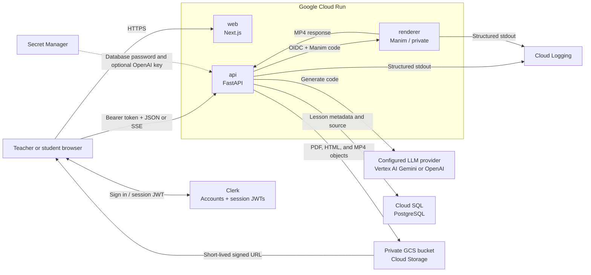

# Chalksmith

[](https://nextjs.org/)
[](https://fastapi.tiangolo.com/)
[](https://opensource.org/licenses/MIT)

[*Chalksmith*](https://chalksmith.ai) is an AI-driven tool for generating code-driven educational STEM animations from natural language. Generate and **edit** lessons through simple prompts, balancing speed and **AI-transparency**.

Supported, exportable formats include:
* Interactive display (p5.js library)
* Presentation (reveal.js library)
* Video (Manim library)

*Disclaimer:* This website is currently in the beta-testing stage, feel free the reach out with any errors.

## Examples

### Video Walkthrough
<div align="center">
  <video src="https://github.com/user-attachments/assets/be35e3f2-7c95-4cef-80a8-daf3e694acc8" width="100%" controls>
    Your browser does not support the video tag.
  </video>
</div>

### Lesson Examples
[**Examples**](https://chalksmith.ai/#examples)

### Sample Topics
* Fractions, Percentages, and Decimals
* Linear Equations
* The Pythagorean Theorem
* Experimental vs. Theoretical Probability
* Phases of the Moon
* Light Reflection and Refraction
* Heat Transfer via Convection
* States of Matter
* Bohr Model of the Atom (Protons, Neutrons, Electrons)
* Law of Conservation of Mass
* Photosynthesis Inputs and Outputs
* Food Web Energy Pyramid
* Natural Selection

## Motivation
Did you know **teachers** spend up to **12 hours** per week on lessons? 5 hours collecting resources, 7 hours building them from scratch. As a high schooler attending an international school with a highly diverse student body, I acutely perceived this issue, especially in STEM subjects where prior experience differed drastically.

From this issue emerged the incentive to create a solution. Over these past few months, I learned how to code, design, and deploy websites, and tested my website with over **50+ students and teachers** across K12 grades.

## Tech Stack

| Layer | Technology | Purpose |
| :--- | :--- | :--- |
| **Frontend** | Next.js 16, React 19, TypeScript | User interface, Clerk session, direct API client |
| **API** | Python 3.12, FastAPI, SQLModel | Authenticated lesson API and generation orchestration |
| **Renderer** | FastAPI, Manim | Isolated execution of generated video code |
| **Database** | Cloud SQL for PostgreSQL | Lesson metadata and source code |
| **Storage** | Private Cloud Storage | PDF sources, HTML outputs, and MP4 outputs |
| **Authentication** | Clerk | Account UI, provider login, and short-lived session JWTs |
| **LLM** | Vertex AI Gemini or OpenAI Responses API | Deployment-configured, interchangeable provider |
| **Runtime** | Cloud Run, Cloud Build, Artifact Registry | Three independently scalable containers |

## Code Architecture

The repository contains two independent application runtimes. Node.js commands are scoped to `frontend/`; Python commands are scoped to `backend/` through uv. There is no root npm workspace and no Next.js API proxy layer.

```text
.
├── frontend/
│   ├── public/                  # Static marketing and example assets
│   ├── src/app/                 # Next.js App Router pages and layouts
│   ├── src/components/          # Auth, dashboard, generation, home, and UI components
│   └── src/lib/
│       ├── api/                 # Bearer-token FastAPI client and SSE parser
│       ├── hooks/               # Authenticated API and generation state hooks
│       └── types/               # Shared frontend API types
├── backend/
│   ├── app/main.py              # Public FastAPI application
│   ├── app/renderer_main.py     # Private Manim renderer application
│   ├── app/api/                 # HTTP routes, validation, dependencies, and SSE
│   ├── app/core/                # Configuration, errors, and structured logging
│   ├── app/db/                  # SQLModel models, sessions, and tenant-safe queries
│   ├── app/integrations/        # Clerk JWT, GCS, Gemini, and OpenAI adapters
│   ├── app/renderers/           # HTML validation and remote/local Manim boundaries
│   ├── app/services/            # Generation, prompts, and PDF extraction
│   ├── scripts/                 # Schema initialization and v1 migration
│   └── tests/                   # Backend unit and API tests
├── infra/docker/                # Web, API, and renderer images
├── bin/                         # Cloud Build configs and the four operations scripts
└── doc/                         # Cloud, authentication, cost, and refactor guides
```

The frontend owns presentation and browser session state. Clerk's Next.js SDK obtains a short-lived session JWT, and the clients in `frontend/src/lib/api/` send it directly to FastAPI as a Bearer token.

The API owns authentication, authorization, generation orchestration, database writes, object storage, and signed access URLs. It verifies Clerk JWT signatures from the Clerk JWKS endpoint and uses the token `sub` as `owner_id`. HTTP handlers remain thin: generation rules live in `services/`, external vendors remain behind `integrations/`, and every lesson query includes the authenticated owner.

The renderer shares backend validation code but has a separate entry point and container. Only `renderer_main.py` executes generated Manim Python. The public API container does not install Manim and cannot fall back to local code execution.

## System Architecture

Production runs three Cloud Run services: a public Next.js web service, a public-network FastAPI service whose application routes require valid Clerk session tokens, and a private Manim renderer callable only by the API service account. Clerk remains an external managed authentication service; Google Cloud hosts the application, data, generation, and rendering services.



A generation request follows one path:

1. The browser sends `POST /v2/generations` with a Clerk session JWT, lesson parameters, and optional PDFs.
2. FastAPI verifies the JWT signature, issuer, expiry, and authorized party; enforces file and request limits; extracts PDF text; and streams progress over SSE.
3. The configured LLM adapter returns a summary and source code. Vertex Gemini streams chunks so the API can report generated-character progress and keep the SSE connection active, but the API buffers the complete response before validation.
4. Interactive p5.js and Reveal.js outputs are validated and secured as HTML inside the API without being executed there. Video code is sent to the isolated renderer over an authenticated service-to-service request.
5. The API uploads the final artifact to private Cloud Storage and stores lesson metadata and source code in Cloud SQL.
6. Preview and download requests return short-lived signed URLs; the database stores stable object keys, never expiring URLs.

The renderer has no Cloud SQL, GCS, Secret Manager, or LLM permissions. The complete API contract, security rationale, migration plan, and implementation decisions are in [REFACTOR.md](doc/REFACTOR.md).

## Prerequisites

Install the following tools:

- Git, Node.js 24+, and npm.
- [uv](https://docs.astral.sh/uv/); uv installs the pinned Python 3.12 runtime and manages `backend/.venv`.
- Manim's operating-system dependencies for video generation. The renderer image installs Cairo, Pango, FFmpeg, build tools, and `pkg-config`; see the [Manim installation guide](https://docs.manim.community/en/stable/installation.html) for the equivalent host setup.

Clone and install

```bash
git clone https://github.com/avarzhou-ctrl/Chalksmith.ai.git
cd Chalksmith.ai
npm --prefix frontend ci
uv sync --project backend --extra video
```

`--extra video` installs Manim for the renderer process. The API Docker image deliberately omits this extra in production.

Run all repository checks before opening a pull request:

```bash
uv lock --project backend --check
uv run --project backend python -m unittest discover -s backend/tests
npm --prefix frontend run typecheck
npm --prefix frontend run build
bash -n bin/prepare.sh bin/setup.sh bin/debug.sh bin/deploy.sh
git diff --check
```

## Debugging and Deployment

You need to have access to Google Cloud Platform (GCP) and Clerk in order to debug and deploy Chalksmith. Google Cloud prerequisites, IAM, Vertex AI, GCS, Cloud SQL, and troubleshooting are maintained in [GCP.md](doc/GCP.md). Clerk application setup and session-token configuration are documented separately in [CLERK.md](doc/CLERK.md), and the sizing rationale behind the deployed configuration is in [COST.md](doc/COST.md).

Every script below is safe to re-run: existing resources are kept, and no step rotates a secret out from under a running deployment.

### 1. Install and authenticate the Google Cloud tools

```bash
# macOS
brew install --cask google-cloud-sdk
brew install cloud-sql-proxy

# Other platforms
#   gcloud          https://cloud.google.com/sdk/docs/install
#   cloud-sql-proxy https://github.com/GoogleCloudPlatform/cloud-sql-proxy/releases

gcloud auth login
gcloud auth application-default login
gcloud config set project your-project-id
```

The two `auth` commands write different credentials and both are required: `login` authorizes the `gcloud` CLI itself, which is what the scripts below run as, while `application-default login` writes the Application Default Credentials the local backend reads for Vertex AI, GCS, and signed URLs. A local backend that reports no project is almost always missing the second one.

`cloud-sql-proxy` is needed only by `bin/debug.sh`. Verify the toolchain before continuing:

```bash
gcloud version && cloud-sql-proxy --version
gcloud auth list
```

### 2. Prepare the roles, APIs and service accounts

Run once per project as the human deployment account, whose own roles are listed in [GCP.md](doc/GCP.md#11-assign-roles-to-human-account). It enables the required APIs, creates `chalksmith-deployer` plus the three runtime accounts, and grants every role that does not depend on the environment.

```bash
./bin/prepare.sh --project=your-project-id --human=teammate@example.com
```

| Flag | Optional | Meaning |
| :--- | :---: | :--- |
| `--project=ID` | No | Target project. Falls back to `PROJECT_ID` in the environment. |
| <nobr>`--human=EMAIL` | Yes | Who receives Token Creator on `chalksmith-deployer`, and therefore who can deploy afterwards. Defaults to the active `gcloud` account. Bindings accumulate, so re-running with a second address lets a colleague deploy too. |

### 3. Create an environment's resources

Creates the two secrets, the private bucket, and the Cloud SQL instance for one environment, then leaves the instance running so the steps below can be repeated without paying its boot time again. `local` is an alias for the staging resources, which local debugging shares. `shutdown` stops the instance and keeps everything else.

```bash
export PROJECT_ID=your-project-id

./bin/setup.sh local|stg|prod start|shutdown
```

The database password is generated on the spot and never printed. The Clerk server key is read from `.env/clerk.key.<env>` — either a bare key or a `CLERK_SECRET_KEY=` line — from `CLERK_KEY_FILE`, or from a prompt when neither exists.

### 4. Debug locally

Starts the Cloud SQL Auth Proxy against the staging instance and the three local processes; `shutdown` stops those four and leaves the instance running for the next session. Requires [`cloud-sql-proxy`](https://cloud.google.com/sql/docs/postgres/sql-proxy) and `.env/env.local`, created from `bin/env.local.template` ([GCP.md](doc/GCP.md#312-configure-local-runtime)).

```bash
./bin/debug.sh start|shutdown
```

Logs and PIDs are written to the ignored `.env/run/` directory.

### 5. Deploy an environment

Builds the images and deploys the three Cloud Run services. The database must already be running, which is step 3's job; a stopped instance aborts the run rather than being started here. `shutdown` deletes those three services and leaves everything else, including the database, in place; against production it asks for a typed confirmation.

```bash
cp bin/env.deploy.template .env/env.deploy
chmod 600 .env/env.deploy

# Replace the template placeholders once, then deploy without an export wrapper.
./bin/deploy.sh prod start
```

For a one-off override, an already-exported variable takes precedence over the
file:

```bash
REVISION_TAG=manual-test ./bin/deploy.sh prod start
```

`deploy.sh` reads project, region, domain, and model settings from the ignored `.env/env.deploy`; exported variables override matching file values. `DOMAIN` is required for `prod start`, and the script derives the root, `www`, and `app` HTTPS origins. It configures the services but does not create DNS records or a load balancer; follow [DOMAIN.md](doc/DOMAIN.md) for domain mapping, DNS, certificates, Clerk, and multiple-domain setup. Staging can use the same file with `./bin/deploy.sh stg start`. The Clerk pair falls back to `.env/clerk.key.<env>`, and the script impersonates `chalksmith-deployer` itself.

Before testing production sign-in, configure the root `DOMAIN` on the Clerk Production instance, complete Clerk's DNS and certificate steps, and create the Cloud Run mappings in [DOMAIN.md](doc/DOMAIN.md). The generated `run.app` URL is for deployment diagnostics; Clerk production keys only work on the configured custom domain.


## Contact
💬 **Contact us:** Feel free to reach out with any errors you encounter to our support email, [help@chalksmith.ai](mailto:help@chalksmith.ai)!

🖥️ **Author:** I'm [Ava Zhou](https://github.com/avarzhou-ctrl). I started building Chalksmith during my high school freshman year as part of a school project—marking my very first full-stack web application. The project grew from a curiosity about systems architecture and a desire to build real-world tools. Want to connect? Feel free to reach out at [avarzhou@gmail.com](mailto:avarzhou@gmail.com).
