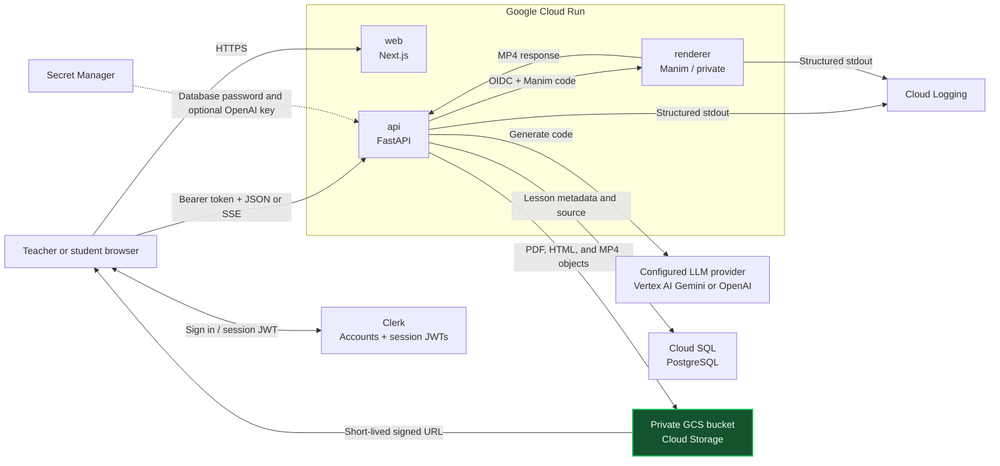

# Chalksmith

[](https://nextjs.org/)
[](https://fastapi.tiangolo.com/)
[](https://opensource.org/licenses/MIT)

[*Chalksmith*](https://chalksmith.ai) is an AI-driven tool for generating code-driven educational STEM animations from natural language. Generate and **edit** lessons through simple prompts, balancing speed and **AI-transparency**.

Supported, exportable formats include:
* Interactive display (p5.js library)
* Presentation (reveal.js library)
* Video (Manim library)

*Disclaimer:* This website is currently in the beta-testing stage, feel free the reach out with any errors.

## Examples

### Video Walkthrough
<div align="center">
  <video src="https://github.com/user-attachments/assets/be35e3f2-7c95-4cef-80a8-daf3e694acc8" width="100%" controls>
    Your browser does not support the video tag.
  </video>
</div>

### Lesson Examples
[**Examples**](https://chalksmith.ai/#examples)

### Sample Topics
* Fractions, Percentages, and Decimals
* Linear Equations
* The Pythagorean Theorem
* Experimental vs. Theoretical Probability
* Phases of the Moon
* Light Reflection and Refraction
* Heat Transfer via Convection
* States of Matter
* Bohr Model of the Atom (Protons, Neutrons, Electrons)
* Law of Conservation of Mass
* Photosynthesis Inputs and Outputs
* Food Web Energy Pyramid
* Natural Selection

## Motivation
Did you know **teachers** spend up to **12 hours** per week on lessons?—5 hours collecting resources, 7 hours building them from scratch. As a high schooler attending an international school with a highly diverse student body, I acutely perceived this issue, especially in STEM subjects where prior experience differed drastically.

From this issue emerged the incentive to create a solution. Over these past few months, I learned how to code, design, and deploy websites, and tested my website with over **50+ students and teachers** across K12 grades.

## Tech Stack

| Layer | Technology | Purpose |
| :--- | :--- | :--- |
| **Frontend** | Next.js 16, React 19, TypeScript | User interface, Clerk session, direct API client |
| **API** | Python 3.12, FastAPI, SQLModel | Authenticated lesson API and generation orchestration |
| **Renderer** | FastAPI, Manim | Isolated execution of generated video code |
| **Database** | Cloud SQL for PostgreSQL | Lesson metadata and source code |
| **Storage** | Private Cloud Storage | PDF sources, HTML outputs, and MP4 outputs |
| **Authentication** | Clerk | Account UI, provider login, and short-lived session JWTs |
| **LLM** | Vertex AI Gemini or OpenAI Responses API | Deployment-configured, interchangeable provider |
| **Runtime** | Cloud Run, Cloud Build, Artifact Registry | Three independently scalable containers |

## Code Architecture

The repository contains two independent application runtimes. Node.js commands are scoped to `frontend/`; Python commands are scoped to `backend/` through uv. There is no root npm workspace and no Next.js API proxy layer.

```text
.
├── frontend/
│   ├── public/                  # Static marketing and example assets
│   ├── src/app/                 # Next.js App Router pages and layouts
│   ├── src/components/          # Auth, dashboard, generation, home, and UI components
│   └── src/lib/
│       ├── api/                 # Bearer-token FastAPI client and SSE parser
│       ├── hooks/               # Authenticated API and generation state hooks
│       └── types/               # Shared frontend API types
├── backend/
│   ├── app/main.py              # Public FastAPI application
│   ├── app/renderer_main.py     # Private Manim renderer application
│   ├── app/api/                 # HTTP routes, validation, dependencies, and SSE
│   ├── app/core/                # Configuration, errors, and structured logging
│   ├── app/db/                  # SQLModel models, sessions, and tenant-safe queries
│   ├── app/integrations/        # Clerk JWT, GCS, Gemini, and OpenAI adapters
│   ├── app/renderers/           # HTML validation and remote/local Manim boundaries
│   ├── app/services/            # Generation, prompts, and PDF extraction
│   ├── scripts/                 # Schema initialization and v1 migration
│   └── tests/                   # Backend unit and API tests
└── infra/
    ├── docker/                  # Web, API, and renderer images
    └── gcloud/                  # Cloud Build, lifecycle, and deployment automation
```

The frontend owns presentation and browser session state. Clerk's Next.js SDK obtains a short-lived session JWT, and the clients in `frontend/src/lib/api/` send it directly to FastAPI as a Bearer token.

The API owns authentication, authorization, generation orchestration, database writes, object storage, and signed access URLs. It verifies Clerk JWT signatures from the Clerk JWKS endpoint and uses the token `sub` as `owner_id`. HTTP handlers remain thin: generation rules live in `services/`, external vendors remain behind `integrations/`, and every lesson query includes the authenticated owner.

The renderer shares backend validation code but has a separate entry point and container. Only `renderer_main.py` executes generated Manim Python. The public API container does not install Manim and cannot fall back to local code execution.

## System Architecture

Production runs three Cloud Run services: a public Next.js web service, a public-network FastAPI service whose application routes require valid Clerk session tokens, and a private Manim renderer callable only by the API service account. Clerk remains an external managed authentication service; Google Cloud hosts the application, data, generation, and rendering services.



A generation request follows one path:

1. The browser sends `POST /v2/generations` with a Clerk session JWT, lesson parameters, and optional PDFs.
2. FastAPI verifies the JWT signature, issuer, expiry, and authorized party; enforces file and request limits; extracts PDF text; and streams progress over SSE.
3. The configured LLM adapter returns a summary and source code.
4. Interactive p5.js and Reveal.js outputs are validated and secured as HTML inside the API without being executed there. Video code is sent to the isolated renderer over an authenticated service-to-service request.
5. The API uploads the final artifact to private Cloud Storage and stores lesson metadata and source code in Cloud SQL.
6. Preview and download requests return short-lived signed URLs; the database stores stable object keys, never expiring URLs.

The renderer has no Cloud SQL, GCS, Secret Manager, or LLM permissions. The complete API contract, security rationale, migration plan, and implementation decisions are in [REFACTOR.md](REFACTOR.md).

## Google Cloud Platform

All Google Cloud setup, local credentials, IAM, Vertex AI, GCS, Cloud SQL, Cloud Run deployment, and troubleshooting instructions are maintained in [GCP.md](GCP.md). Clerk application setup and session-token configuration are documented separately in [CLERK.md](CLERK.md).

---

## Local Development and Debugging

### Prerequisites

Install the following tools:

- Git, Node.js 24+, and npm.
- [uv](https://docs.astral.sh/uv/); uv installs the pinned Python 3.12 runtime and manages `backend/.venv`.
- Manim's operating-system dependencies for video generation. The renderer image installs Cairo, Pango, FFmpeg, build tools, and `pkg-config`; see the [Manim installation guide](https://docs.manim.community/en/stable/installation.html) for the equivalent host setup.

Complete the Clerk and Google Cloud setup described above before testing authenticated generation. Marketing pages, frontend builds, health checks, and unit tests can run without live cloud services.

### 1. Clone and install

```bash
git clone https://github.com/avarzhou-ctrl/Chalksmith.ai.git
cd Chalksmith.ai
npm --prefix frontend ci
uv sync --project backend --extra video
```

`--extra video` installs Manim for the renderer process. The API Docker image deliberately omits this extra in production.

### 2. Start the three processes

Run every command from the repository root in a separate terminal.

Terminal 1 — private renderer equivalent on port 8081:

```bash
uv run --project backend uvicorn backend.app.renderer_main:renderer_app --reload --port 8081
```

Terminal 2 — public API on port 8000:

```bash
uv run --project backend uvicorn backend.app.main:app --reload --port 8000
```

Terminal 3 — Next.js on port 3000:

```bash
npm --prefix frontend run dev
```

The API never executes Manim locally. If the renderer process is not running, interactive and slide generation can still work, but video generation returns a renderer-unavailable error.

### 3. Verify and debug

| URL | Purpose |
| :--- | :--- |
| `http://localhost:3000` | Web application |
| `http://localhost:8000/docs` | FastAPI OpenAPI explorer |
| `http://localhost:8000/healthz` | API health check |
| `http://localhost:8081/healthz` | Renderer health check |

Quick health checks:

```bash
curl http://localhost:8000/healthz
curl http://localhost:8081/healthz
```

The API and renderer write structured logs to their terminals. API responses also include `X-Request-ID`; use that value to match a browser failure with its request and generation-stage logs.

Run all repository checks before opening a pull request:

```bash
uv lock --project backend --check
uv run --project backend python -m unittest discover -s backend/tests
npm --prefix frontend run typecheck
npm --prefix frontend run build
bash -n infra/gcloud/deploy.sh
git diff --check
```

## Contact
💬 **Contact us:** Feel free to reach out with any errors you encounter to our support email, [help@chalksmith.ai](mailto:help@chalksmith.ai)!

🖥️ **Author:** I'm [Ava Zhou](https://github.com/avarzhou-ctrl). I started building Chalksmith during my high school freshman year as part of a school project—marking my very first full-stack web application. The project grew from a curiosity about systems architecture and a desire to build real-world tools. Want to connect? Feel free to reach out at [avarzhou@gmail.com](mailto:avarzhou@gmail.com).
