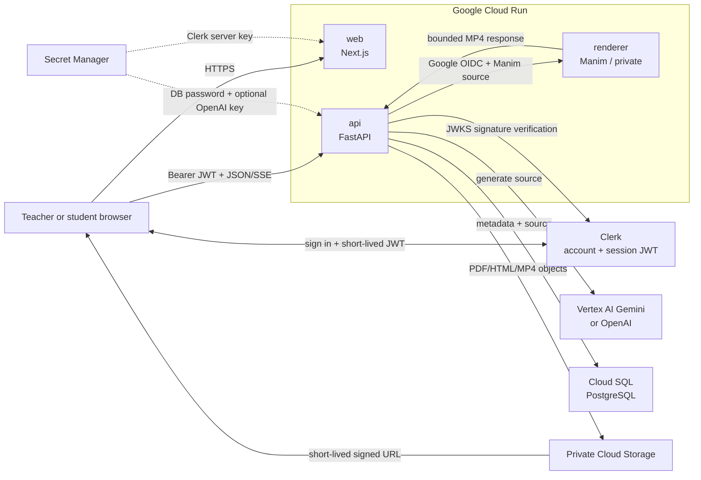
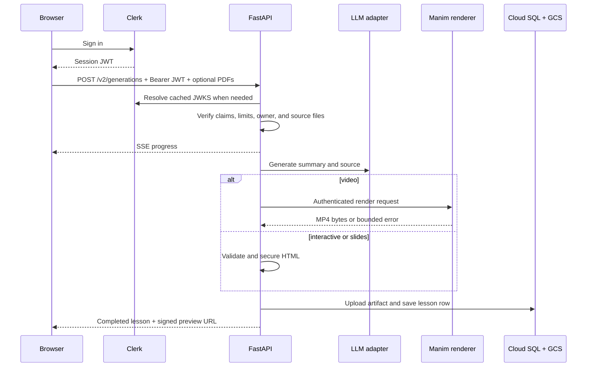

# Chalksmith v2 Architecture and Refactor Record

> Last reviewed: 2026-08-11
> Status: code architecture implemented; live-provider, cloud-resource, migration, and end-to-end production validation remain.

## 1. Goals

The v2 refactor keeps Chalksmith's product behavior while making security and ownership boundaries explicit:

- one Next.js frontend and one FastAPI codebase with separate API and renderer entry points;
- direct browser-to-FastAPI requests authenticated with Clerk session JWTs;
- tenant isolation through the verified JWT `sub` stored as `lessons.owner_id`;
- one provider contract for Vertex AI Gemini and OpenAI;
- private object storage and stable database references instead of local generated files;
- generated Manim Python executed only by a permissionless renderer service;
- independent `frontend/` npm and `backend/` uv runtimes;
- local secrets and service configuration centralized in the ignored root `.env/` directory.

## 2. Current decisions

| Area | Decision | Reason |
| :--- | :--- | :--- |
| Authentication | Clerk Next.js SDK + backend JWKS verification | Restores the simpler v1 account experience without trusting a frontend proxy |
| API path | Browser calls FastAPI directly with a Bearer token | Removes duplicate Next.js lesson proxies and keeps authorization at the data boundary |
| User data | Store only Clerk `sub` on lesson records | No local password store, session table, or duplicated user directory |
| Database | SQLite locally; Cloud SQL PostgreSQL in production | Fast local setup with managed production persistence |
| Artifacts | Private GCS objects referenced by `object_key` | Survives restarts and prevents public bucket access |
| LLM | Deployment-selected Vertex AI or OpenAI adapter | One business flow, no provider logic in HTTP routes |
| Video | Manim only, in a private isolated service | Generated Python must not run with database or LLM privileges |
| Interactive/slides | p5.js and Reveal.js HTML | Code-driven, exportable browser formats |
| Deployment | Three Cloud Run services | Web, data/LLM API, and untrusted renderer scale and authorize independently |

No account-sync Webhook is part of v2. It should be added only if a future feature requires a local user profile; lesson ownership does not require it.

## 3. System architecture



Trust boundaries:

1. Clerk proves the end-user session; it does not authorize lesson access by itself.
2. FastAPI validates token signature, issuer, expiry, optional audience, and `azp` authorized party.
3. Every database and object key operation is scoped by the verified `sub`.
4. The web service never sends a trusted user-ID header to FastAPI.
5. The renderer accepts only Cloud Run IAM-authenticated calls from the API service account.
6. The renderer has no Cloud SQL, GCS, LLM, or Secret Manager roles.

## 4. Authentication design

### 4.1 Frontend

- `ClerkProvider` owns browser session context.
- Clerk modal components handle sign-up, sign-in, reset, provider callbacks, account linking, sign-out, and account settings.
- `useApi()` calls Clerk `getToken()` and passes the returned session JWT to the shared API client.
- The API client adds `Authorization: Bearer <token>` to JSON, upload, download, and SSE requests.
- A single forced token refresh is attempted after an API `401`.
- `RequireAuth` is a presentation guard; FastAPI remains the security boundary.
- `clerkMiddleware()` integrates Clerk with Next.js while retaining the existing marketing/app-subdomain routing behavior.

### 4.2 Backend

`backend/app/integrations/auth.py` performs authentication without a Clerk backend SDK:

1. require the Bearer scheme;
2. load the signing key from `<CLERK_ISSUER>/.well-known/jwks.json` or `CLERK_JWKS_URL`;
3. accept only `RS256`;
4. verify signature, issuer, expiry, and optional audience;
5. reject an `azp` not listed in `CLERK_AUTHORIZED_PARTIES`;
6. return `AuthUser(uid=claims["sub"])`.

Invalid or expired tokens return `401`. A JWKS availability/configuration failure returns `503`. Authentication errors never expose token contents.

### 4.3 Existing users

Production should reuse the v1 Clerk application so existing `user_...` IDs remain stable. The v1 migration can then preserve owner IDs explicitly. If a different Clerk application is unavoidable, migration requires a reviewed old-ID to new-ID map; accounts are never merged solely by email.

## 5. Request and generation flow



One `GenerationService` owns the full deadline and state transition:

1. validate the owner and optional edit source;
2. validate/extract PDFs and upload accepted sources;
3. create a `generating` lesson row;
4. call the selected `LLMProvider`;
5. parse and validate the generated source;
6. render once, with one bounded repair attempt for video;
7. upload the final artifact;
8. mark the lesson `ready` or persist a bounded failure;
9. stream ordered progress events throughout.

## 6. Repository architecture

```text
.
├── frontend/
│   ├── public/                     # Marketing and example assets
│   ├── src/app/                    # Next.js App Router pages/layouts
│   ├── src/components/
│   │   ├── auth/                   # Clerk-backed auth UI and route guard
│   │   ├── dashboard/
│   │   ├── generation/
│   │   ├── home/
│   │   └── ui/
│   ├── src/lib/
│   │   ├── api/                    # Direct Bearer-token API/SSE clients
│   │   ├── hooks/                  # Authenticated API and generation state
│   │   └── types/                  # API-facing TypeScript types
│   ├── src/proxy.ts                # Clerk integration + host routing
│   ├── package.json
│   └── package-lock.json
├── backend/
│   ├── app/
│   │   ├── api/                    # FastAPI routes and request validation
│   │   ├── core/                   # Settings, errors, logging
│   │   ├── db/                     # SQLModel models and owner-scoped queries
│   │   ├── integrations/           # Clerk JWT, storage, LLM adapters
│   │   ├── renderers/              # HTML validation and Manim boundary
│   │   ├── services/               # Generation, prompts, source extraction
│   │   ├── main.py                 # Public API entry point
│   │   └── renderer_main.py        # Private renderer entry point
│   ├── scripts/                    # Schema initialization and v1 migration
│   ├── tests/
│   ├── pyproject.toml
│   └── uv.lock
├── infra/
│   ├── docker/                     # Web, API, renderer images
│   └── gcloud/                     # Cloud Build and deployment automation
├── CLERK.md
├── GCP.md
├── README.md
└── REFACTOR.md
```

The repository has no root npm workspace. Use `npm --prefix frontend ...` and `uv ... --project backend` from the repository root.

## 7. API and ownership rules

Public health route:

```text
GET /healthz
```

Authenticated application routes:

```text
POST   /v2/generations
GET    /v2/lessons
GET    /v2/lessons/{lesson_id}
PATCH  /v2/lessons/{lesson_id}
DELETE /v2/lessons/{lesson_id}
GET    /v2/lessons/{lesson_id}/preview
GET    /v2/lessons/{lesson_id}/download
```

All lesson reads, updates, deletes, previews, and exports query by both lesson ID and authenticated owner ID. A valid user cannot discover or manipulate another user's lesson by guessing UUIDs.

The frontend and backend share these canonical values:

```text
format: interactive | slides | video
status: generating | ready | failed | deleting
```

Errors use one envelope:

```json
{
  "error": {
    "code": "stable_machine_code",
    "message": "Safe user-facing message",
    "details": {}
  }
}
```

SSE emits `stage`, `progress`, `completed`, and `error` events with a single terminal event.

## 8. Data and storage

`lessons` stores metadata, source code, status, stable `object_key`, and `owner_id`; it never stores expiring signed URLs. Object keys are namespaced:

```text
lessons/{owner_id}/{lesson_id}/lesson.html
lessons/{owner_id}/{lesson_id}/lesson.mp4
sources/{owner_id}/{lesson_id}/{filename}.pdf
```

The bucket has Uniform Bucket-Level Access and Public Access Prevention. Preview/download endpoints return short-lived V4 signed URLs after owner-scoped database lookup. Uploaded source files follow lifecycle rules, and lesson deletion marks the row `deleting` before removing objects and the row so retries are safe.

## 9. Generated-code security

### HTML

- Validate document structure and add a restrictive CSP.
- Open generated HTML from a separate GCS origin.
- Use an iframe `sandbox` without unnecessary same-origin or navigation privileges.
- Apply private caching and explicit content disposition.

### Manim Python

- Parse the source AST and allow only the expected Manim surface.
- Reject filesystem, process, network, dynamic import, reflection, and unsafe built-in access.
- Run only in the renderer service with CPU, memory, timeout, output-size, and concurrency limits.
- Kill the complete subprocess group on timeout or cancellation.
- Never install Manim in the production API image and never fall back to local API execution.

AST filtering is defense in depth; IAM isolation is the primary boundary.

## 10. Configuration

Backend variables:

```text
APP_ENV
APP_ROLE
FRONTEND_ORIGINS
CLERK_ISSUER
CLERK_JWKS_URL              # optional override
CLERK_AUDIENCE              # optional
CLERK_AUTHORIZED_PARTIES
GCP_PROJECT_ID
GOOGLE_APPLICATION_CREDENTIALS  # local only
LLM_PROVIDER
LLM_MODEL
LLM_TIMEOUT_SECONDS
LLM_MAX_OUTPUT_TOKENS
VERTEX_AI_LOCATION
OPENAI_API_KEY              # selected provider only
CLOUD_SQL_INSTANCE
DATABASE_URL
DATABASE_NAME
DATABASE_USER
DATABASE_PASSWORD
GCS_BUCKET
GCS_SIGNER_SERVICE_ACCOUNT
SIGNED_URL_TTL_SECONDS
GENERATION_TIMEOUT_SECONDS
MANIM_TIMEOUT_SECONDS
MAX_RENDER_BYTES
MANIM_RENDERER_URL
MAX_SOURCE_FILES
MAX_SOURCE_BYTES
MAX_TOTAL_SOURCE_BYTES
MAX_SOURCE_CHARACTERS
AUTO_CREATE_TABLES
```

Frontend variables:

```text
NEXT_PUBLIC_API_URL
NEXT_PUBLIC_CLERK_PUBLISHABLE_KEY
CLERK_SECRET_KEY
```

Only `NEXT_PUBLIC_*` values are compiled for the browser. `CLERK_SECRET_KEY`, database passwords, and provider keys are server secrets. Production injects secrets from Secret Manager; local values remain under `.env/`.

## 11. Deployment architecture

The deployment creates these identities:

| Identity | Access |
| :--- | :--- |
| `chalksmith-web` | Clerk secret only |
| `chalksmith-api` | Cloud SQL, lesson bucket, URL signing, configured LLM, API secrets, renderer invocation |
| `chalksmith-renderer` | No project data/model/secret roles |

Build-time public values are limited to `NEXT_PUBLIC_API_URL` and the Clerk publishable key. The Next.js server receives its secret at runtime. The FastAPI service receives only the Clerk issuer/allowlist, because public-key JWT verification does not require the Clerk secret.

See [GCP.md](GCP.md) for cloud provisioning and [CLERK.md](CLERK.md) for authentication configuration.

## 12. v1 migration

The migration is dry-run-first and requires:

- `V1_DATABASE_URL` for the source;
- `DATABASE_URL` for v2;
- `GCS_BUCKET` for artifacts;
- a v1 static-output backup or separate `v1.0` worktree.

When reusing the v1 Clerk application, apply with `--preserve-owner-ids`. Otherwise provide an explicit `--owner-map`. Missing artifacts create failed lesson records rather than falsely marking the lesson ready. Remotion rows normalize to `video`; the original static file is migrated when present, but no Remotion runtime remains.

## 13. Removed architecture

The following are intentionally absent from v2:

- trusted `x-user-id` headers and Next.js lesson API proxies;
- account-sync Webhooks and the duplicated local user table;
- local generated-output persistence in `backend/static/`;
- Remotion runtime and its duplicate video pipeline;
- a root npm workspace and duplicate lockfile;
- VPS/daemontools startup scripts and Vercel deployment configuration;
- LLM selection in the end-user interface;
- automatic cross-provider fallback;
- API-container execution of generated Python.

## 14. Verification baseline

Required repository checks:

```bash
uv lock --project backend --check
uv run --project backend python -m unittest discover -s backend/tests
npm --prefix frontend run typecheck
npm --prefix frontend run build
bash -n infra/gcloud/deploy.sh
git diff --check
```

Automated coverage includes configuration validation, shared errors/CORS/request IDs, tenant-scoped CRUD, generation SSE order, provider abstraction, source limits, renderer AST rejection, process-group cancellation, deadlines, and bounded diagnostics.

Still required in real environments:

- Clerk sign-up/sign-in/sign-out and token renewal for every enabled provider;
- valid, expired, wrong-issuer, wrong-`azp`, and unavailable-JWKS authentication cases;
- v1 user/lesson ownership migration;
- Vertex AI and optional OpenAI smoke tests;
- Cloud SQL/GCS/signed-URL integration;
- all three lesson formats through generate, edit, preview, reopen, export, and delete;
- renderer IAM isolation;
- desktop/mobile UI regression;
- production domain and CORS behavior.

## 15. Production completion criteria

The architecture is ready to cut over only when:

- the same intended Clerk application is configured for all production domains;
- every API route except health checks rejects a missing or invalid JWT;
- cross-user lesson access tests fail safely;
- only the selected LLM adapter has credentials;
- all artifacts are private and reachable only through owner-checked signed URLs;
- generated Python executes only in the private renderer;
- the data migration passes dry-run and post-migration reconciliation;
- builds, automated checks, cloud smoke tests, and end-to-end regressions pass;
- monitoring, cost alerts, backups, and rollback are documented;
- production runs successfully through the agreed observation window.

The model-provider terms and data handling for a student/teacher audience remain a separate product and legal review item; they do not change this code boundary.
