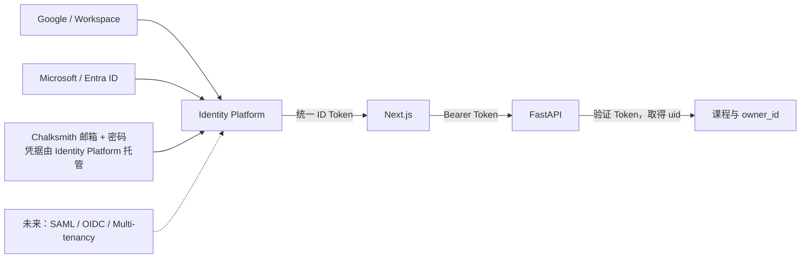
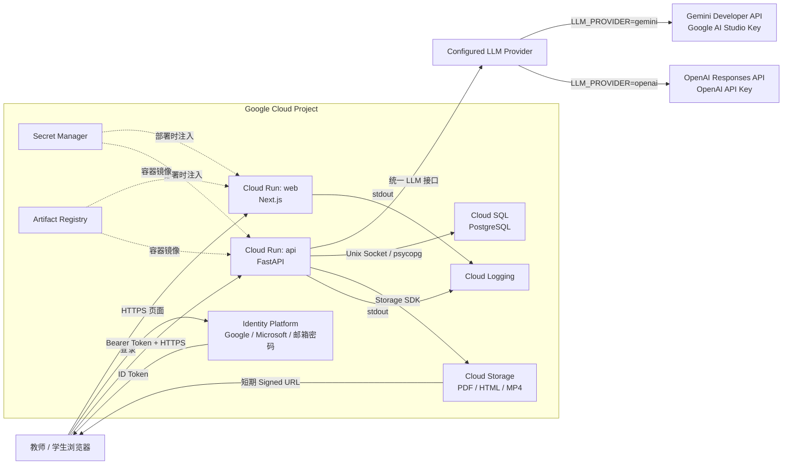
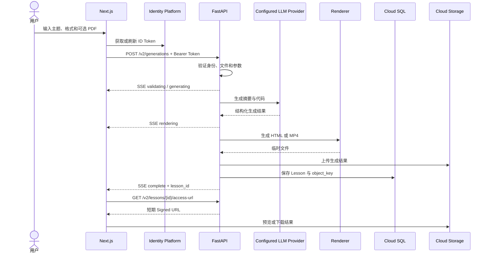
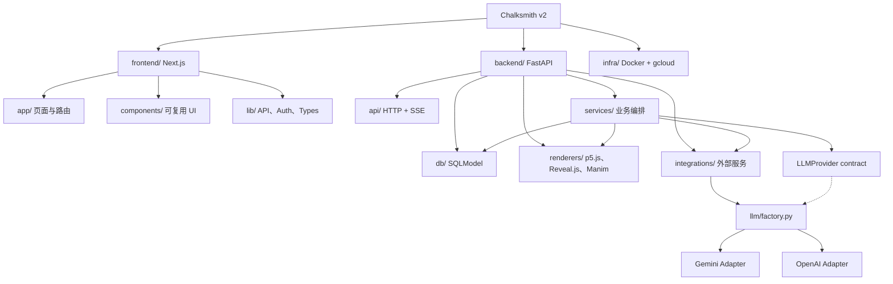
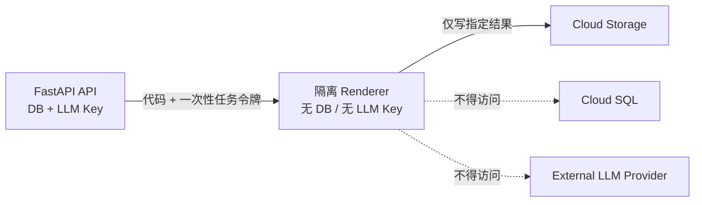

# Chalksmith v2 重构计划

> 状态：提案
> 目标版本：v2
> 基准版本：`v1.0`
> 最后更新：2026-08-10

## 1. 重构目标

这次重构的首要目标不是增加功能，而是减少代码层级、运行服务和维护成本，同时为 Google Cloud 部署建立清晰边界。

具体目标：

- 保留 Chalksmith 的核心能力：输入主题或资料，生成交互、幻灯片和视频课程。
- 前端只负责页面、交互、身份令牌和结果展示。
- 后端统一使用 Python，负责业务逻辑、LLM 调用、渲染编排、数据库和文件存储。
- 将当前多个 Next.js API 代理收敛为一个前端 API Client，浏览器直接调用 FastAPI。
- 将 LLM 调用收敛到统一 Provider 接口；默认使用 Google AI Studio Key 调用 Gemini Developer API，也可仅通过配置切换到 OpenAI GPT。
- 将数据库收敛为 Cloud SQL PostgreSQL。
- 将所有生成文件迁移到 Cloud Storage，不依赖容器本地 `static/` 目录。
- 使用 Google Cloud Identity Platform 管理最终用户身份，移除 Clerk Webhook 和用户同步逻辑。
- 初期保持同步流式生成，不立即引入消息队列、微服务或 Kubernetes。
- 对生成代码的执行建立明确安全边界，避免让不可信代码长期运行在拥有数据库权限的 API 容器中。

## 2. 不在本次范围内

- 不增加订阅、配额、Stripe 或复杂计费功能。
- 不引入 GKE、Terraform、多区域数据库、服务网格或事件驱动微服务。
- 不在前端开放任意 Provider、模型或 API Key 配置；首版由部署环境统一选择后端 Provider。
- 不实现自动故障切换、负载均衡或跨 Provider 重试，避免一次请求产生不可预测的行为和费用。
- 不重做营销页面视觉设计。
- 不在重构过程中修改课程生成效果，先保证行为等价，再迭代 Prompt。

## 3. 核心技术决策

| 领域 | v2 决策 | 原因 |
|---|---|---|
| 前端 | Next.js + React + TypeScript + Tailwind CSS | 保留当前技术栈，避免无收益重写 |
| 后端 | Python 3.12 + FastAPI | 当前 LLM、PDF、Manim、SQLModel 生态均以 Python 为主 |
| ORM | SQLModel + psycopg | 延续现有模型，降低迁移成本 |
| 数据库 | Cloud SQL for PostgreSQL | 替代 Neon，统一到 GCP |
| LLM | 统一 Provider 接口；Gemini Developer API 默认、OpenAI Responses API 可选 | 业务层不感知厂商，仅通过配置切换实现 |
| 文件存储 | Cloud Storage | 替代 `backend/static/`，适配无状态容器 |
| 身份认证 | Google Cloud Identity Platform：Google、Microsoft、托管邮箱密码 | 替代 Clerk，以统一 ID Token 支持三种首版登录方式 |
| API | 浏览器直接调用 FastAPI `/v2/*` | 删除重复的 Next.js API 代理层 |
| 生成流 | `fetch()` POST + SSE 响应流 | 同时支持 Bearer Token、JSON/文件上传和进度事件 |
| 部署 | Cloud Run | 前后端分别容器化并自动缩容 |
| 配置 | Pydantic Settings + Secret Manager 注入环境变量 | 只有一个配置入口，应用不自行读取多个 `.env` |
| 日志 | stdout 结构化日志 + Cloud Logging | 不建设单独日志服务 |

### 3.1 后端继续使用 Python

后端建议继续使用 Python，而不是改写成 Node.js：

- Manim、PyMuPDF、SQLModel 和当前生成流程已经是 Python。
- FastAPI 原生支持异步请求、流式响应、依赖注入和 OpenAPI。
- 切换语言会产生大规模无业务收益的重写。
- 移除 Remotion 后，后端不再需要为了视频渲染同时维护 Node.js 运行时。

### 3.2 输出格式收敛

v2 只保留当前用户界面真实开放的三种格式：

| API 值 | 实现 | 输出 |
|---|---|---|
| `interactive` | p5.js | HTML |
| `slides` | Reveal.js | HTML |
| `video` | Manim | MP4 |

删除隐藏的 Remotion 路径、JSON Blueprint、Remotion Player 和相关 Node 渲染依赖。若产品后续决定重新启用 Remotion，应作为独立功能提案，而不是保留半启用代码。

### 3.3 认证迁移策略

v2 首版统一启用以下三种登录方式：

| 登录方式 | Identity Platform 实现 | 首版策略 |
|---|---|---|
| Google | Google Provider | 启用，覆盖个人 Google 与 Google Workspace 账号 |
| Microsoft | Microsoft OAuth Provider | 启用，覆盖个人 Microsoft 与 Microsoft Entra ID 账号；首版不限制单一 Entra Tenant |
| Chalksmith 邮箱密码 | Identity Platform Email/Password | 启用，由 Identity Platform 保存凭据、重置密码和签发 Token |

实现参考：[Google 登录](https://cloud.google.com/identity-platform/docs/web/google)、[Microsoft 登录](https://cloud.google.com/identity-platform/docs/web/microsoft) 和 [邮箱密码登录](https://cloud.google.com/identity-platform/docs/sign-in-user-email)。

Chalksmith 保留自有品牌的登录和注册页面，但不自建密码表、密码哈希、Session 或找回密码服务。三种登录方式最后都取得相同格式的 Identity Platform ID Token，FastAPI 只验证该 Token，不为不同登录方式建立三套认证逻辑。

暂不进入首版的能力：

- 自定义账号库与 Custom Token 登录。现有需求可由托管邮箱密码覆盖，避免承担密码安全责任。
- SAML/OIDC 学校或学区 SSO。待出现明确机构客户后，作为 Identity Provider 配置扩展，不修改业务 API。
- Identity Platform Multi-tenancy。待需要按学校隔离用户、Provider 和认证策略时再启用。

账号关联必须遵循以下规则：

- 同一用户可以关联 Google、Microsoft 或邮箱密码凭据，关联后继续使用同一个 Identity Platform `uid`。
- 不得仅因为 email 相同就在后端静默合并账号；用户必须先验证已有登录方式，再显式关联新凭据。
- 前端必须处理 `account-exists-with-different-credential`，引导用户使用原方式登录后完成关联；参考 [Identity Platform account linking](https://cloud.google.com/identity-platform/docs/multi-tenancy-authentication#linking_multi-tenant_user_credentials)。
- 课程所有权只绑定稳定 `uid`，不绑定可能变化的 email 或 Provider 用户 ID。

认证迁移分两步完成：

1. 先定义统一的 `AuthUser` 和后端 Bearer Token 验证接口；过渡期允许 Clerk Adapter。
2. 配置三种首版登录方式并迁移用户与课程所有权；完成后删除 Clerk 包、Webhook、`proxy.ts` Clerk 逻辑和 `User` 同步表。

数据库中的课程所有权只存认证系统提供的稳定 `owner_id`。除非未来需要额外用户资料，否则不再建立本地 `User` 表。



### 3.4 Google AI Studio 与 Vertex AI 的区别

Gemini Provider 使用 Google AI Studio 中创建的 Gemini API Key，对应 **Gemini Developer API**，不是 Vertex AI：

| 项目 | Gemini Developer API | Vertex AI Gemini |
|---|---|---|
| 入口 | Google AI Studio / Gemini API | Google Cloud Vertex AI |
| 认证 | `GEMINI_API_KEY` | Service Account + ADC/IAM |
| Python Client | `genai.Client(api_key=...)` | `genai.Client(vertexai=True, project=..., location=...)` |
| 本计划 | 采用 | 暂不采用 |

两者都使用官方 `google-genai` SDK，因此以后迁移 Vertex AI 时，不需要重写 Prompt 和生成编排，只需调整 Gemini Adapter 的 Client 初始化与部署配置。

合规门槛：截至本计划日期，[Gemini API Additional Terms](https://ai.google.dev/gemini-api/terms) 规定 Gemini Developer API 的使用者须年满 18 岁，并限制将 API Client 面向或提供给可能未满 18 岁的用户。Chalksmith 的目标受众包含中小学生，因此在正式发布前必须确认实际使用场景是否满足条款；若不满足，应切换 Vertex AI 或选择经确认适用于该场景的服务。此项属于发布阻断条件，不应仅以技术可用作为上线依据。

### 3.5 可互换的 LLM Provider

`GenerationService` 只依赖一个小型协议，不导入 Gemini 或 OpenAI SDK：

```python
from dataclasses import dataclass
from typing import Protocol


@dataclass
class LLMResponse:
    text: str
    provider: str
    model: str
    input_tokens: int | None = None
    output_tokens: int | None = None


class LLMProvider(Protocol):
    async def generate(self, prompt: str) -> LLMResponse: ...
```

- `GeminiProvider` 使用 `google-genai` 和 `GEMINI_API_KEY`。
- `OpenAIProvider` 使用官方 `openai` Python SDK、`OPENAI_API_KEY` 和 Responses API。OpenAI 当前模型文档将 Responses API 作为最新模型的调用入口之一：[OpenAI Models](https://developers.openai.com/api/docs/models)。
- `create_llm_provider(settings)` 在应用启动时读取 `LLM_PROVIDER` 并创建唯一 Provider；不在每次请求中分支。
- Prompt 模板、课程格式规则、自动修复流程和结果校验留在业务层；Adapter 只负责 SDK 参数转换、文本提取、Token 用量和错误标准化。
- 模型 ID 只使用 `LLM_MODEL` 配置，不在业务代码硬编码 Gemini Preview 或 GPT 型号。
- 未选中的 Provider 不要求配置对应 Key；选中的 Provider 缺少 Key 或模型时，应用启动应立即失败并给出清晰错误。
- 首版只实现 Gemini 与 OpenAI 两个显式 Adapter，不使用“OpenAI-compatible base URL”包装所有厂商；各家的结构化输出、安全设置、错误和计费语义并不完全一致。

Chalksmith 面向未成年人时还必须逐一核对所选 Provider 的条款与数据处理要求。OpenAI 的官方未成年人 API 指南要求额外的安全措施，并对未满 13 岁或当地数字同意年龄儿童的个人数据提出 Zero Data Retention 要求：[Under 18 API Guidance](https://developers.openai.com/api/docs/guides/safety-checks/under-18-api-guidance)。这属于上线合规检查，不等同于法律意见。

## 4. 目标运行架构



### 4.1 为什么浏览器直接调用 FastAPI

当前链路是“浏览器 → Next.js API Route → FastAPI”，课程相关请求在两层重复实现。v2 改为“浏览器 → FastAPI”：

- 前端从 Identity Platform 获取 ID Token。
- `frontend/src/lib/api/client.ts` 自动加入 `Authorization: Bearer <token>`。
- FastAPI 验证 Token 并取得 `uid`。
- FastAPI CORS 只允许正式前端域名和本地开发地址。
- FastAPI 返回一致的 JSON 或 SSE 错误格式。

这样可以删除 `frontend/src/app/api/lesson-*`、`api/lessons`、`api/sources/upload` 等代理路由，也不再需要 `X-User-Id` 和 `INTERNAL_BACKEND_SECRET`。

### 4.2 生成请求采用统一 POST 流

所有生成请求都使用一个接口：

```http
POST /v2/generations
Authorization: Bearer <identity-platform-id-token>
Content-Type: multipart/form-data
Accept: text/event-stream
```

无附件和有附件不再走两套实现。前端统一使用 `fetch()` 读取响应流，因为原生 `EventSource` 无法设置 Bearer Token，也不适合上传文件。



## 5. 目标代码结构

目录只按“页面 / API / 业务服务 / 外部集成”拆分。避免建立只有一个文件的过细抽象，也不使用泛型 Repository、事件总线或复杂领域框架。推荐的物理目录：

```text
.
├── frontend/
│   ├── public/
│   ├── src/
│   │   ├── app/
│   │   │   ├── (marketing)/
│   │   │   ├── (app)/
│   │   │   │   ├── generation/page.tsx
│   │   │   │   └── dashboard/page.tsx
│   │   │   ├── globals.css
│   │   │   └── layout.tsx
│   │   ├── components/
│   │   │   ├── ui/
│   │   │   ├── lessons/
│   │   │   └── home/
│   │   └── lib/
│   │       ├── api/
│   │       │   ├── client.ts
│   │       │   └── generation-stream.ts
│   │       ├── auth/
│   │       │   └── identity.ts
│   │       └── types/
│   │           └── api.ts
│   ├── package.json
│   └── next.config.ts
├── backend/
│   ├── app/
│   │   ├── api/
│   │   │   ├── auth.py
│   │   │   ├── generation.py
│   │   │   ├── health.py
│   │   │   └── lessons.py
│   │   ├── core/
│   │   │   ├── config.py
│   │   │   ├── errors.py
│   │   │   └── logging.py
│   │   ├── db/
│   │   │   ├── models.py
│   │   │   ├── lessons.py
│   │   │   └── session.py
│   │   ├── integrations/
│   │   │   ├── identity.py
│   │   │   ├── storage.py
│   │   │   └── llm/
│   │   │       ├── base.py
│   │   │       ├── factory.py
│   │   │       ├── gemini.py
│   │   │       └── openai.py
│   │   ├── renderers/
│   │   │   ├── base.py
│   │   │   ├── manim.py
│   │   │   ├── p5js.py
│   │   │   └── revealjs.py
│   │   ├── services/
│   │   │   ├── exports.py
│   │   │   ├── generation.py
│   │   │   └── sources.py
│   │   └── main.py
│   ├── tests/
│   ├── requirements.txt
│   └── .env.example
├── infra/
│   ├── docker/
│   │   ├── api.Dockerfile
│   │   └── web.Dockerfile
│   └── gcloud/
│       └── deploy.sh
├── AGENTS.md
├── README.md
└── REFACTOR.md
```



## 6. 后端功能模块

### 6.1 `api/`

只做 HTTP 层工作：

- 参数解析和 Pydantic 校验。
- Identity Platform Token 验证依赖。
- 调用 service，不直接写 SQL、不直接调用 GCP SDK。
- 将业务异常映射为统一错误响应。
- 生成 SSE 事件。

### 6.2 `services/generation.py`

唯一的课程生成编排器：

1. 校验课程主题和格式。
2. 提取可选资料文本。
3. 加载旧课程代码用于编辑。
4. 构建 Prompt 并调用配置的 `LLMProvider`。
5. 解析摘要和代码。
6. 选择 Renderer。
7. 将结果上传 Cloud Storage。
8. 保存数据库记录。
9. 逐阶段产生进度事件。

Router 和 Renderer 都不应重复这套流程。

### 6.3 `renderers/`

通过一个很小的协议统一三种实现：

```python
class Renderer(Protocol):
    async def render(self, code: str, workdir: Path) -> RenderedAsset: ...
```

- `P5jsRenderer`：校验完整 HTML 后写入临时文件。
- `RevealjsRenderer`：校验完整 HTML 后写入临时文件。
- `ManimRenderer`：执行 Manim 子进程、限制超时、收集错误并生成 MP4。
- Renderer 只返回文件，不访问数据库。
- 自动修复属于 `generation.py`，Renderer 只报告结构化错误。

### 6.4 `integrations/`

每类外部系统仅有一个业务入口：

- `llm/base.py`：定义统一请求、响应与错误协议。
- `llm/factory.py`：根据配置创建唯一 Provider 实例。
- `llm/gemini.py`：Gemini Developer API Adapter。
- `llm/openai.py`：OpenAI Responses API Adapter。
- `storage.py`：上传、删除、生成 Signed URL。
- `identity.py`：验证 ID Token，返回 `AuthUser(uid, email)`。

### 6.5 `db/`

- `session.py`：Engine 和请求 Session。
- `models.py`：SQLModel 表。
- `lessons.py`：课程查询和写入。
- 所有查询必须显式包含 `owner_id`，避免跨用户读取。

不再保留独立 `crud/users.py`、Webhook 用户同步和多个含义重叠的 lesson router。

## 7. 最小 API 设计

| Method | Path | 用途 |
|---|---|---|
| `GET` | `/healthz` | Cloud Run 健康检查，不需要用户认证 |
| `POST` | `/v2/generations` | 新建或编辑课程，返回 SSE 流 |
| `GET` | `/v2/lessons` | 当前用户课程列表，支持 `q`、`format` |
| `GET` | `/v2/lessons/{id}` | 当前用户读取单个课程 |
| `PATCH` | `/v2/lessons/{id}` | 修改标题 |
| `DELETE` | `/v2/lessons/{id}` | 删除数据库记录和 GCS 对象 |
| `POST` | `/v2/lessons/{id}/access-url` | 返回短期预览/下载 URL |

不再保留：

- 同一功能的同步 `/lesson` 与流式 `/lesson/generate` 双实现。
- 按 topic、model、format 查找最近课程的接口。
- 单独的 source preview 代理接口。
- Next.js 中镜像 FastAPI CRUD 的 API Routes。

## 8. 最小数据模型

v2 初期只需要一个业务表：

```text
Lesson
├── id: UUID, primary key
├── owner_id: string, indexed
├── topic: string
├── format: interactive | slides | video
├── status: generating | ready | failed
├── summary: text, nullable
├── source_code: text, nullable
├── object_key: string, nullable
├── error_message: text, nullable
├── created_at: timestamp
└── updated_at: timestamp
```

约束：

- API 永远通过 `(id, owner_id)` 查询课程。
- 数据库保存 GCS `object_key`，不保存会过期的 Signed URL。
- Identity Platform 保存账户；本地数据库不复制 email，除非未来有明确业务需求。
- 编辑课程默认创建新 Lesson 版本，保留旧结果；若产品希望覆盖，需要在实现前明确。

## 9. GCP 服务与外部 LLM API 调用方法

### 9.1 Cloud Run

用途：运行 `web` 和 `api` 两个容器。

调用方法：

- 用户通过 HTTPS 调用 Cloud Run。
- `web` 允许公开访问。
- `api` 允许公开网络访问，但所有 `/v2/*` 接口必须校验 Identity Platform Token。
- 使用 Request-based billing、`min-instances=0`。
- API 初期将并发设置较低，避免多个 Manim 同时耗尽内存。
- 生成超时设置为高于正常最长渲染时间，但每次生成仍要有应用级超时。

### 9.2 LLM Provider

用途：通过统一接口生成课程摘要和代码。部署时选择一个 Provider，不做自动回退。

#### 9.2.1 Gemini Developer API（Google AI Studio）

用途：生成课程摘要和代码。

调用方法：

```python
from google import genai

client = genai.Client(
    api_key=settings.gemini_api_key,
)
```

- 在 Google AI Studio 创建新的 Gemini API Key；优先使用当前默认创建的 authorization key，不沿用无约束的旧 standard key。
- Key 只存在 Secret Manager，通过 Cloud Run `--set-secrets` 注入为 `GEMINI_API_KEY`。
- Key 不得放入 `NEXT_PUBLIC_*`、浏览器 Bundle、Git 仓库、日志或数据库。
- 模型名称通过通用 `LLM_MODEL` 配置，业务代码中不硬编码 Preview 版本。
- Prompt 按输出格式拆成三个模板，但模型调用入口只有统一 `LLMProvider`。
- API 调用、配额和模型费用归属于该 AI Studio Key 关联的 Google Cloud Project，但它不是 Vertex AI 调用。
- 若未来切换 Vertex AI，只替换 Gemini Adapter 的 Client 初始化和认证方式。

#### 9.2.2 OpenAI API

调用方法：

```python
from openai import AsyncOpenAI

client = AsyncOpenAI(api_key=settings.openai_api_key)
response = await client.responses.create(
    model=settings.llm_model,
    input=prompt,
)
text = response.output_text
```

- Key 只存在 Secret Manager，通过 Cloud Run `--set-secrets` 注入为 `OPENAI_API_KEY`。
- Adapter 使用 Responses API，并将返回文本、模型、Token 用量和错误映射为公共类型。
- OpenAI 专用参数只能存在于 Adapter 或 Provider 配置中，不能泄漏到 `GenerationService`。
- 切换 Provider 只修改 `LLM_PROVIDER`、`LLM_MODEL` 和对应 Secret，不修改 Router、Service 或前端代码。

### 9.3 Cloud SQL for PostgreSQL

用途：保存课程元数据、代码和用户所有权。

调用方法：

- Cloud Run 配置 Cloud SQL instance attachment。
- SQLAlchemy/SQLModel 通过 `/cloudsql/<INSTANCE_CONNECTION_NAME>` Unix Socket 连接。
- 数据库密码从 Secret Manager 注入。
- API Service Account 授予 Cloud SQL Client 权限。
- 第一阶段使用单区小实例；达到稳定生产需求后再考虑 HA。

示意连接串：

```text
postgresql+psycopg://USER:PASSWORD@/DATABASE?host=/cloudsql/INSTANCE_CONNECTION_NAME
```

### 9.4 Cloud Storage

用途：保存用户上传资料和生成的 HTML、MP4。

调用方法：

```python
from google.cloud import storage

client = storage.Client()
bucket = client.bucket(settings.gcs_bucket)
blob = bucket.blob(object_key)
blob.upload_from_filename(local_path, content_type=content_type)
```

对象路径统一为：

```text
lessons/{owner_id}/{lesson_id}/output.html
lessons/{owner_id}/{lesson_id}/output.mp4
sources/{owner_id}/{request_id}/{filename}.pdf
```

- 预览和导出返回短期 V4 Signed URL。
- Bucket 禁止公开访问。
- 设置生命周期规则清理失败任务和临时 source。
- HTML 在独立 GCS Origin 打开，并在前端 iframe 上使用 `sandbox`，避免生成脚本取得主站权限。

### 9.5 Identity Platform

用途：统一处理 Google、Microsoft 和托管邮箱密码的注册、登录、密码重置与 ID Token。

调用方法：

- 在 Google Cloud Console 启用 Google Provider、Microsoft Provider 和 Email/Password。
- Microsoft Provider 配置 Microsoft App ID 与 Secret；首版允许个人 Microsoft 与 Entra ID 账号，后续可按机构要求限制 Tenant。
- 前端使用 Firebase Web SDK 的 `GoogleAuthProvider`、`OAuthProvider("microsoft.com")` 和 Email/Password 方法完成登录。
- 登录页面、按钮和表单由 Chalksmith 前端实现；Identity Platform 托管凭据和 Token，不使用自建密码数据库。
- 三种方式登录成功后都取得 Identity Platform ID Token。
- 每次 API 请求在 Authorization Header 中携带 Token。
- 后端使用 Firebase Admin SDK 验证 Token：

```python
from firebase_admin import auth

decoded = auth.verify_id_token(token)
user_id = decoded["uid"]
```

- Cloud Run 使用默认 Service Account 凭据，不提交凭据文件。
- 账号关联必须要求用户先验证已有凭据，不按 email 自动静默合并。
- 首版不配置 SAML、OIDC、Multi-tenancy 或 Custom Token；未来增加这些 Provider 时，FastAPI 验证流程保持不变。
- 删除 Clerk Webhook、本地用户注册接口以及任何本地密码存储职责。

### 9.6 Secret Manager

用途：保存数据库密码、签名配置和少量敏感设置。

调用方法：

- 在 `gcloud run deploy` 中通过 `--set-secrets` 注入环境变量。
- 应用只读取环境变量，不在每个请求中调用 Secret Manager API。
- 非敏感配置，例如 region、bucket、model，使用普通 Cloud Run 环境变量。

### 9.7 Artifact Registry 与 Cloud Build

用途：构建和保存两个容器镜像。

调用方法：

- `api.Dockerfile` 构建 FastAPI + Manim 运行环境。
- `web.Dockerfile` 构建 Next.js standalone 输出。
- Cloud Build 构建后推送 Artifact Registry。
- Cloud Run 从同一区域 Artifact Registry 部署，避免跨区域传输。

### 9.8 Cloud Logging

用途：收集访问、生成阶段、LLM 和渲染错误。

调用方法：

- 应用输出单行 JSON 到 stdout/stderr。
- 每条日志包含 `request_id`、`lesson_id`、`owner_id_hash`、`stage`、`duration_ms`。
- 不记录 PDF 原文、生成代码全文、Token、email 或 API Key。

## 10. 配置与环境变量

后端只通过 `backend/app/core/config.py` 读取配置：

```text
APP_ENV
FRONTEND_ORIGINS
GCP_REGION
LLM_PROVIDER                 # gemini | openai
LLM_MODEL                    # Provider 对应的模型 ID
LLM_TIMEOUT_SECONDS
LLM_MAX_OUTPUT_TOKENS
GEMINI_API_KEY             # Secret Manager
OPENAI_API_KEY             # Secret Manager
CLOUD_SQL_INSTANCE
DATABASE_NAME
DATABASE_USER
DATABASE_PASSWORD        # Secret Manager
GCS_BUCKET
SIGNED_URL_TTL_SECONDS
GENERATION_TIMEOUT_SECONDS
MANIM_TIMEOUT_SECONDS
```

`LLM_PROVIDER` 默认设为 `gemini`。部署只需注入被选中 Provider 的 Key；`config.py` 应使用条件校验，不能要求 Gemini 与 OpenAI 两个 Key 同时存在。

前端仅保留可公开配置：

```text
NEXT_PUBLIC_API_URL
NEXT_PUBLIC_FIREBASE_API_KEY
NEXT_PUBLIC_FIREBASE_AUTH_DOMAIN
NEXT_PUBLIC_FIREBASE_PROJECT_ID
```

不要在前端使用 `NEXT_PUBLIC_*` 保存后端地址以外的私密信息。Firebase Web 配置用于标识项目，不作为服务器秘密。

## 11. 安全边界

### 11.1 生成的 HTML

- p5.js 和 Reveal.js HTML 必须在与主站不同的 GCS Origin 中运行。
- iframe 使用 sandbox，不能同时启用不必要的 `allow-same-origin` 和 `allow-top-navigation`。
- 上传时设置正确 `Content-Type`、`Content-Disposition` 和安全响应头。

### 11.2 生成的 Manim Python

LLM 生成的 Python 属于不可信代码。长期生产环境中不得让它在拥有 Cloud SQL、LLM API Key 和用户数据权限的 API 容器内直接执行。

为保持第一阶段代码简单，可以先保持一个后端代码库，但正式公开视频生成前必须完成下面的隔离之一：

1. 推荐：将同一 backend image 以 `renderer` 角色部署为独立 Cloud Run 服务或 Job，只授予最小 GCS 权限。
2. 或者：将视频生成改为受约束的 JSON Scene Schema，由可信 Renderer 渲染，不执行任意 Python。

该安全拆分不需要创建第二套代码库；`renderers/` 仍然共享，但 API 容器不执行生成脚本。



## 12. 应删除或合并的当前代码

计划完成后删除：

- `frontend/src/app/api/lesson-generate/`
- `frontend/src/app/api/lesson-record/`
- `frontend/src/app/api/lesson-list/`
- `frontend/src/app/api/lessons/`
- `frontend/src/app/api/lesson-export/`
- `frontend/src/app/api/sources/upload/`
- `frontend/src/app/api/webhooks/clerk/`
- `frontend/src/lib/auth-headers.ts`
- Clerk 相关依赖和 `frontend/src/proxy.ts` 中的 Clerk 保护逻辑
- `backend/routers/users.py`
- `backend/crud/users.py`
- 旧 `llm.py` 中散落的 Provider 分支、未使用模型选项和与 UI 耦合的模型选择逻辑；由明确的 Gemini/OpenAI Adapter 取代
- Remotion Renderer、Player、依赖和 `frontend/src/remotion/`
- `backend/static/` 中的持久化职责
- VPS daemontools 部署脚本

需要合并：

- 所有课程生成入口 → `/v2/generations`
- `backend/models.py` → `backend/app/db/models.py`
- `backend/database.py` → `backend/app/db/session.py`
- `crud/lessons.py` → `backend/app/db/lessons.py`
- 两个 `GenerationSidebar` → 一个 `components/lessons/GenerationPanel.tsx`
- 前端所有 API 函数 → `lib/api/client.ts` 和 `generation-stream.ts`

删除必须安排在替代实现通过测试之后，不在第一阶段直接清空旧路径。

## 13. 重构实施阶段

### Phase 0：建立基线

- 确认 `v1.0` 分支可以构建和运行。
- 为当前关键流程记录手工回归步骤。
- 禁止在重构期间向 v1 同时加入大功能。

验收：能够从 `v1.0` 恢复当前生产版本。

### Phase 1：建立 v2 骨架

- 创建 `backend/app/` 新目录，不立即移动所有旧代码。
- 增加集中配置、统一错误和 `/healthz`。
- 创建前端 `lib/api/`、`lib/auth/` 和共享 API 类型。
- 添加最小单元测试框架。

验收：新 FastAPI 入口可以启动，健康检查通过。

### Phase 2：迁移 GCP 数据与存储

- 创建 Cloud SQL、Cloud Storage、Secret Manager 和 Service Account。
- 将数据库 Engine 切换到 Cloud SQL。
- 将 Renderer 输出改为临时目录 + GCS 上传。
- 数据库改存 `object_key`。
- 完成 Neon 数据迁移脚本和校验。

验收：重启或扩容 Cloud Run 后，已有课程仍能预览和下载。

### Phase 3：收敛生成流程

- 建立 `LLMProvider` 协议、Factory、Gemini Adapter 和 OpenAI Adapter。
- 通过 `LLM_PROVIDER` 与 `LLM_MODEL` 选择实现，并从 Secret Manager 只注入所选 Provider 的 Key。
- 完成统一 `GenerationService`。
- 合并 GET EventSource 与 POST 文件流为统一 POST SSE。
- 统一格式值和错误码。
- 删除同步生成重复实现。

验收：Gemini 与 OpenAI 均通过同一组契约测试；仅修改配置即可切换，三种格式均能生成、编辑、停止、保存和导出。

### Phase 4：认证迁移

- 实现 `AuthUser` Adapter。
- 接入 Identity Platform 的 Google、Microsoft 和 Email/Password Provider。
- 完成 Chalksmith 品牌的登录、注册、密码重置和退出页面。
- 建立 Clerk UID 到 Identity Platform UID 的迁移映射或账号重新登录策略，并迁移课程 `owner_id`。
- 实现凭据关联流程，处理 `account-exists-with-different-credential`，禁止仅按 email 静默合并。
- 前端改为 Bearer Token 直连 API。
- 删除 Next API 代理、Webhook 和内部共享密钥。

验收：Google、Microsoft 和邮箱密码都能登录并取得统一 ID Token；密码重置、凭据关联可用；未登录请求返回 401；用户无法读取其他用户课程。

### Phase 5：整理前端

- 将 generation 页面中的状态逻辑抽到 `useGeneration` 或一个 controller hook。
- 合并重复 sidebar 和 API 类型。
- 保留页面级组件编排，不建立全局状态库。
- 删除 Remotion 和 Clerk 残余依赖。

验收：前端 production build 通过，主要页面在移动端和桌面端可用。

### Phase 6：Manim 安全隔离

- 将 Manim Renderer 部署到最小权限运行环境。
- 限制 CPU、内存、执行时间、输出大小和可用环境变量。
- API 容器不再执行生成 Python。
- 添加恶意代码和超时测试。

验收：Renderer 无权访问 Cloud SQL、LLM API Key 或 Secret Manager。

### Phase 7：切流与清理

- 在测试环境执行完整回归。
- 灰度切换正式域名。
- 观察错误率、延迟和费用。
- 删除旧 Neon、VPS、Vercel 与 Clerk 资源前导出备份。
- 最后删除旧代码路径和已废弃依赖。

验收：连续运行一周无数据丢失或跨用户访问问题，具备回滚方案。

## 14. 测试计划

### 后端单元测试

- Prompt 和格式映射。
- `LLMProvider` 契约、Factory 配置校验与统一错误映射。
- Gemini/OpenAI 响应解析和 Token 用量标准化。
- PDF 无文本层、超限和损坏文件处理。
- Renderer 选择和结构化错误。
- 所有 lesson 查询包含 owner_id。

### 后端集成测试

- Identity Token 有效、过期、缺失。
- Google、Microsoft 和 Email/Password 登录产生的 Token 都映射为同一 `AuthUser` 结构。
- Clerk UID 到 Identity Platform UID 的课程所有权迁移。
- Cloud SQL CRUD。
- GCS 上传、Signed URL 和删除。
- `/v2/generations` SSE 事件顺序。
- 生成取消后子进程终止。
- 使用 Fake Provider 运行完整生成流程；真实 Provider smoke test 仅在显式提供测试 Key 时运行。

### 前端测试

- Google、Microsoft、邮箱注册登录、密码重置、退出、登录状态和 Token 刷新。
- 相同 email 使用不同 Provider 时的已有凭据验证与账号关联流程。
- 无附件与有附件使用同一个生成客户端。
- 流式进度、完成、认证失败、渲染失败和中止。
- Dashboard 搜索、重命名、删除和打开课程。

### 最小端到端回归

1. 分别使用 Google、Microsoft 和邮箱密码登录。
2. 生成 p5.js 课程。
3. 上传 PDF 生成 Reveal.js 课程。
4. 生成 Manim 视频。
5. 编辑已生成课程。
6. 从 Dashboard 重新打开。
7. 下载结果。
8. 删除课程并确认 GCS 对象被删除。

## 15. 可观测性与费用保护

- 为 Cloud Run、Cloud SQL、Cloud Storage 和当前选择的 LLM Provider 设置费用与使用量告警。
- 记录每次生成的模型耗时、渲染耗时、Token 数、文件大小和最终状态。
- Manim 并发初期限制为 1，每个实例最大并发保持较低。
- Cloud Run 默认允许缩容到 0，不设置常驻 Renderer。
- GCS 临时 source 设置短生命周期，课程结果按产品保留策略处理。
- LLM Provider 和渲染必须设置单次请求上限，防止异常 Prompt 造成不可控费用。

## 16. 完成标准

重构完成必须同时满足：

- 生产只运行 GCP 上的 web、api，以及必要的隔离 renderer。
- 课程业务不再经过重复的 Next.js API 代理。
- 不再依赖 Neon、VPS、Vercel、Clerk 或本地持久化静态目录。
- 后端业务层只依赖统一 `LLMProvider`；Gemini 与 OpenAI 可仅通过部署配置互换，Key 只能从 Secret Manager 注入。
- Google、Microsoft 和 Identity Platform 托管邮箱密码均可登录，并向 FastAPI 提供统一 ID Token。
- 应用不保存密码或实现自有 Session；同一用户的多种凭据可以安全关联到稳定 `uid`。
- 数据库中没有不必要的认证用户副本。
- 三种格式生成、编辑、预览、导出和删除全部可用。
- 所有课程操作按 owner_id 隔离。
- 生成文件全部存储在私有 GCS Bucket。
- Manim 不可信代码与数据服务权限隔离。
- 前后端 production build、测试和部署文档均通过验证。
- 可以在一个工作日内从备份和 `v1.0` 分支恢复旧版本。

## 17. 实施前需要确认的产品决策

以下决策应在开始删除旧代码前确认：

1. 现有 Clerk 用户采用批量迁移还是重新登录绑定，以及课程 `owner_id` 如何回填；不能仅按 email 自动合并。
2. Gemini Developer API 或 OpenAI API 的当前条款、数据处理方式与未成年人目标受众是否兼容；不兼容时选择哪个合规服务。
3. 正式环境默认使用 Gemini 还是 OpenAI，以及具体 `LLM_MODEL`；首版是否确认不向终端用户暴露模型选择。
4. 是否确认删除 Remotion，只保留 p5.js、Reveal.js 和 Manim。
5. 编辑课程是覆盖原课程，还是每次创建一个新版本。
6. 生成文件与用户上传资料的保留期限。
7. 是否允许 v2 发布初期暂时关闭视频功能，直到 Manim 隔离完成。

这些是产品边界，不应由重构代码隐式决定。
