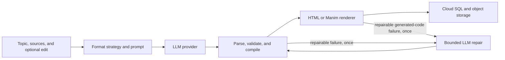

# Lesson Output and Layout Architecture

> Last reviewed: 2026-09-01
> Status: Documents the current implementation
> Scope: Slides, Interactive, and Video generation, rendering, and preview

## 1. Architecture at a glance

Chalksmith has one generation workflow and three format-specific contracts. The formats deliberately
do not share one output language because their rendering and failure modes are different.

| Format | Model output | Platform preparation | Stored artifact |
| :--- | :--- | :--- | :--- |
| Slides | `chalksmith.slides.v2` JSON | Validate the Spec and compile deterministic Reveal.js HTML | HTML |
| Interactive | Complete HTML, CSS, and JavaScript using p5.js | Validate the document, inject missing owned assets, and apply CSP | HTML |
| Video | Python defining one Manim `GeneratedScene` | Validate Python, inject the owned visual runtime, and render in isolation | MP4 |

The model owns teaching content and format-appropriate semantic choices. The platform owns security
boundaries, persistence, artifact assembly, and all deterministic rendering available for that
format. Generated JSON, HTML, JavaScript, and Python are always untrusted input.

### 1.1 Generation flow



`GenerationService` owns this workflow. `LessonFormatStrategy` supplies `build_prompt()`,
`prepare()`, repair eligibility, and the repair prompt. A successful generation normally makes one
model call. A repairable model-output or render failure may make one additional call. Platform and
infrastructure failures are not sent to the model for arbitrary patches.

### 1.2 Ownership

The model owns:

- the learning goal, teaching sequence, examples, checks, and recap;
- Slides Block, presentation, appearance, background, and layout choices;
- complete Interactive lesson behavior inside the required HTML contract;
- Manim scene composition using the approved Video runtime helpers.

The platform owns:

- the canonical preview frame and artifact access boundary;
- Slides document structure, Reveal initialization, KaTeX loading, Block markup, and CSS;
- Interactive document checks, required runtime injection, CSP, and iframe sandboxing;
- Video typography helpers, palette, Python policy checks, and isolated rendering;
- bounded repair, version metadata, revision lineage, storage, and publication.

## 2. Shared stage and persistence

All formats target a stable 16:9 teaching surface. `LessonViewport` preserves that ratio for iframe
and video previews and letterboxes when the generation panel has a different shape. Slides use a
logical 1280 by 720 Reveal stage. Lessons scale as a complete composition; they do not reflow like a
general responsive web page.

`Lesson` keeps the generated `source_code` for code view, export, and debugging. The following
metadata is optional because the formats have different levels of deterministic compilation:

| Field | Current use |
| :--- | :--- |
| `lesson_spec` | Canonical validated Slides v2 JSON; null for code-driven formats |
| `spec_version` | `chalksmith.slides.v2` for structured Slides |
| `runtime_version` | Slides or Video runtime embedded in the derived source |
| `compiler_version` | Slides or Video compiler that produced the source |
| `source_code` | Compiled Slides HTML, generated Interactive HTML, or compiled Manim Python |

Slides edits use the prior canonical Spec. Legacy Slides rows without a Spec remain viewable from
their persisted artifact but are read-only. Interactive and Video edits use prior generated code.
Every edit creates a new lesson revision under the existing root and parent lineage.

## 3. Slides v2

### 3.1 Contract

Slides separate four independent decisions:

| Layer | Question | Examples |
| :--- | :--- | :--- |
| Block | What is the content shape? | prose, list, equation, custom-html |
| Presentation | How is that shape internally organized? | numbered list, accent rows, spotlight |
| Appearance | What surface emphasis does it receive? | plain, card, soft, accent |
| Layout | Where does each Block sit on the page? | row-2, top-1-bottom-2, right-wide |

Each Block occupies one compiler-owned layout slot. Blocks stay in authored order, and the compiler
never infers layout from the subject or Block type.

```json
{
  "schema_version": "chalksmith.slides.v2",
  "format": "slides",
  "summary": "Teacher-facing summary.",
  "title": "Equivalent Fractions",
  "learning_goal": "Explain why two fractions can name the same quantity.",
  "grade_band": "elementary",
  "language": "en",
  "payload": {
    "slides": [
      {
        "title": "Build an equivalent fraction",
        "label": "Worked example",
        "background": "default",
        "layout": "right-wide",
        "blocks": [
          {
            "type": "list",
            "presentation": "numbered",
            "appearance": "card",
            "items": [
              {"summary": "Start with one half."},
              {"summary": "Multiply both parts by two."}
            ]
          },
          {
            "type": "equation",
            "appearance": "card",
            "items": [
              {
                "latex": "\\frac{1}{2} \\times \\frac{2}{2} = \\frac{2}{4}",
                "explanation": "Multiply both parts by the same value."
              }
            ]
          }
        ]
      }
    ]
  }
}
```

The lesson contains 5 to 9 slides. A slide contains 1 to 6 Blocks, an optional label, one of four
background tokens (`default`, `soft`, `accent`, or `contrast`), and a layout name. The schema
forbids unknown fields; bounded response recovery may drop only fields Pydantic explicitly reports
as extra.

### 3.2 Block catalog

| Block | Shape and bounds | Presentations | Use |
| :--- | :--- | :--- | :--- |
| `prose` | 1-4 paragraphs; 260 characters each | `body`, `lead` | Continuous explanation or one focal statement |
| `list` | 2-6 items; summary, optional explanation, optional badge | `bullets`, `numbered`, `accent-rows`, `timeline`, `bands` | Parallel facts, steps, stages, or ordered layers |
| `key-point` | One summary, explanation, and optional badge | `standard`, `accent-bar`, `callout`, `spotlight`, `tagged` | One conclusion, warning, definition, or takeaway |
| `table` | 2-4 columns and 1-5 rows | None | A real lookup or row/column comparison |
| `equation` | 1-5 ordered LaTeX items with optional explanations | None | One formula, a derivation, or related formulas |
| `custom-html` | Description plus at most 6,000 HTML characters | Owned markup within one slot | Diagrams, plots, models, arrays, and other complex visuals |

The five structured Blocks share `plain`, `card`, `soft`, and `accent` appearances. `custom-html`
always receives the compiler's contained card wrapper and supplies only sanitized internal markup.

#### Prose presentations

| Presentation | Rendering | Selection rule |
| :--- | :--- | :--- |
| `body` | Standard paragraphs aligned from the top | Normal explanation |
| `lead` | Larger focal copy | One opening idea or thesis |

#### List presentations

| Presentation | Rendering | Selection rule |
| :--- | :--- | :--- |
| `bullets` | Conventional bullet markers | Unordered parallel facts |
| `numbered` | Owned circular number markers | Steps, reasoning, or an operation sequence |
| `accent-rows` | Separated rows with an accent bar | Parallel summary-plus-explanation items |
| `timeline` | Ordered nodes on a line | Chronology or an explicitly linear process |
| `bands` | Ordered horizontal bands | Layers, levels, stages, or ranges |

Manual `1.`, `2.`, `3.` prefixes inside prose or key-point text are not a list. Ordered content must
use one `list` Block with `presentation=numbered`.

#### Key-point presentations

| Presentation | Rendering | Selection rule |
| :--- | :--- | :--- |
| `standard` | Plain summary and explanation | General takeaway |
| `accent-bar` | Accent border on the left | A result tied to adjacent reasoning |
| `callout` | Strong border and surface | Important warning or conclusion |
| `spotlight` | High-contrast focal card | One primary idea |
| `tagged` | Badge separated from the content | A named category, state, or result |

### 3.3 Layout catalog

The Spec accepts `auto` and fourteen explicit layouts. The compiler fills slots in Block order.

| Layout | Blocks | Structure | Use |
| :--- | :---: | :--- | :--- |
| `single` | 1 | One full-width slot | One dense or focal Block |
| `row-2` | 2 | Two equal columns | Parallel Blocks |
| `row-3` | 3 | Three equal columns | Three short parallel Blocks |
| `column-2` | 2 | Two equal full-width rows | Blocks that both need width |
| `grid-2-by-2` | 4 | Two columns by two rows | Four short parallel Blocks |
| `grid-3-by-2` | 5 or 6 | Three columns by two rows | Five or six very short Blocks |
| `top-1-bottom-2` | 3 | Full-width overview above two columns | Overview and two branches |
| `top-1-bottom-3` | 4 | Full-width overview above three columns | Overview and three examples |
| `top-2-bottom-1` | 3 | Two columns above a full-width conclusion | Two premises and one conclusion |
| `top-3-bottom-1` | 4 | Three columns above a full-width conclusion | Three inputs and one summary |
| `left-wide` | 2 | Wide left and narrow right | Left Block needs more room |
| `right-wide` | 2 | Narrow left and wide right | Right Block needs more room |
| `left-1-right-2` | 3 | Tall left beside two stacked right slots | One focal idea and two details |
| `left-2-right-1` | 3 | Two stacked left slots beside a tall right | Two supports and one focal result |

`top-1-bottom-*` rows size to their content and align from the top so lower cards are not stretched
merely to fill the stage. In the inverse layouts, the bottom conclusion uses its natural height and
the upper details receive the remaining height.

`auto` maps Block counts deterministically: 1 to `single`, 2 to `row-2`, 3 to `row-3`, 4 to
`grid-2-by-2`, and 5 or 6 to `grid-3-by-2`. An explicit layout with an incompatible Block count uses
the same equal-layout fallback without an LLM repair.

### 3.4 Choosing structured content or a visual

Structured Blocks are the default for ordinary text. `custom-html` is required when the teaching
idea depends on spatial, structural, relational, sequential, or quantitative relationships that the
structured Blocks cannot preserve.

| Teaching relationship | Current representation | Notes |
| :--- | :--- | :--- |
| Continuous explanation | `prose` | Do not create a custom text panel |
| Parallel facts or steps | `list` | Use the presentation matching order and semantics |
| One conclusion | `key-point` | Put multiple conclusions in separate layout slots |
| Lookup or compact comparison | `table` | Do not use a table as page layout |
| Formula or derivation | `equation` | Use several items instead of one multiline expression |
| Labeled object or anatomy | `custom-html` with inline SVG | Keep labels connected to the inspected parts |
| Cycle, flow, hierarchy, or network | `custom-html` with inline SVG | Connections and direction must carry meaning |
| Overlap, containment, or classification | `custom-html`, or `table` when spatial overlap is unnecessary | Choose by the relationship learners must see |
| Bar chart, spectrum, number line, or coordinate/function plot | `custom-html` with scaled SVG | Values and axes must be semantically accurate |
| Geometry, force, wave, particle, reaction, or cell model | `custom-html` with inline SVG | Preserve subject notation and spatial constraints |
| Array, tree, recurrence, or transformation | `custom-html` plus a structured explanation | Show alignment, parent-child links, grouping, or change between states |

The generation prompt performs a visual-teaching check before Block selection. A lesson with a
meaningful visual relationship must include at least one explanatory visual. Useful figures,
arrays, charts, or models in teacher sources must be reconstructed around their essential teaching
relationships rather than merely transcribed. Every visual is paired with nearby structured content
that says what to notice and what conclusion to draw. Decorative custom HTML does not satisfy this
requirement.

This replaces the retired v1 catalog of subject-specific diagram Block types. A new typed Block is
justified only when a representation recurs often, custom generation is measurably unreliable, and
a structured contract can add deterministic correctness checks.

### 3.5 Custom HTML boundary

`custom-html` is a normal Slides capability, not an unrestricted escape hatch. It controls only its
assigned slot.

| Boundary | Current rule |
| :--- | :--- |
| Markup size | 6,000 characters; prompt target is below 5,000 |
| CSS size | The prompt permits one style block; each sanitized style block is limited to 2,500 characters |
| Structure | At most 300 elements and 12 nesting levels |
| Content | Allowlisted text/table HTML and inline SVG |
| Styling | Allowlisted layout, spacing, typography, border, color, and SVG paint properties |
| Scoping | Classes, ids, selectors, and local SVG references are namespaced per Block |
| Resources | No remote or dynamic values; only local `url(#id)` references |
| Execution | No scripts, events, forms, frames, media, canvas, or animation elements |
| Page ownership | No global selectors, Reveal configuration, page positioning, or sibling targeting |

The sanitizer rejects forbidden elements and attributes, strips unsupported properties, scopes the
remaining stylesheet, and requires visible content or SVG. Theme variables such as `--cs-text`,
`--cs-muted`, `--cs-accent`, `--cs-surface`, and `--cs-border` keep custom visuals consistent with
the deck. There is no arbitrary deck-level custom HTML count cap; every instance is independently
bounded.

### 3.6 Mathematics, density, and typography

Structured text is plain text, not Markdown. Genuine inline mathematical notation uses `$...$` in
titles and structured fields. An Equation item's `latex` field contains KaTeX without delimiters.
The compiler detects math across the rendered document, loads pinned KaTeX assets, and performs one
document-wide typesetting pass. Inline math inherits surrounding type size.

Each slide has a hard 720 learner-visible-character capacity. Markup, CSS, and the accessibility-only
custom description do not count; visible custom content does. Narrow third, quarter, and sixth slots
need substantially less copy than full-width or half-width slots. Content should be split across
slides instead of being shrunk or hidden.

Runtime typography and surfaces live in compiler CSS. List and Equation explanations use the same
body size as key-point explanations. Numbered markers, Block padding, formula alignment, and card
height behavior are platform-owned and are not prompt vocabulary.

### 3.7 Parsing, compilation, and recovery

`StructuredSlidesStrategy`:

1. builds the prompt from the schema, layout catalog, Block rules, math rules, visual rules, and the
   sanitizer's own compact allowlist description;
2. extracts one JSON object and performs bounded syntax recovery for common provider mistakes;
3. normalizes legacy `body` to `blocks`, a single Block object to a list, the legacy single-equation
   shape to `items`, unknown layouts to `auto`, and empty labels away;
4. validates the strict Pydantic Spec and drops only fields explicitly reported as extra;
5. compiles validated Blocks to a standalone Reveal document.

The compiler renders Blocks in order, applies one layout class, inlines `core.css`, `layouts.css`,
`blocks.css`, and `custom.css`, and adds pinned Reveal and conditional KaTeX assets. The shared HTML
renderer then validates the document boundary and adds CSP before storage.

### 3.8 Code map

```text
backend/app/lessons/formats/slides/
├── prompt.py
├── spec.py
├── strategy.py
├── compiler.py
├── presentation/
│   ├── __init__.py      # Discriminated Block union and render dispatch
│   ├── content.py       # Five structured models and renderers
│   ├── custom.py        # Custom contract, sanitizer, and renderer
│   └── layouts.py       # Layout names, counts, and fallback
└── assets/
    ├── core.css         # Stage, tokens, header, footer, and Reveal overrides
    ├── layouts.css      # Page composition
    ├── blocks.css       # Structured Block rendering
    └── custom.css       # Containment defaults for authored visuals
```

Do not reintroduce subject directories or add a Block only because a new topic appears. Keep
content shapes in `content.py`, visual safety in `custom.py`, page composition in `layouts.py`, and
document assembly in `compiler.py`.

## 4. Interactive

Interactive remains code-driven. The model returns one complete HTML document with p5.js, lesson
controls, styles, and behavior. The prompt requires a 16:9 composition, visible instructions and
units, immediate feedback, coherent mode state, safe pointer-coordinate handling, and bounded loops.

`InteractiveStrategy` uses the shared summary plus `---CODE_START---` response envelope. It stores
the generated HTML directly as `source_code`; there is no canonical Interactive Spec yet.

`HTMLRenderer(required_marker="p5")` currently provides the platform boundary:

- requires one complete `html` and `body` document;
- permits remote scripts and styles only from HTTPS jsDelivr and cdnjs;
- injects the pinned p5.js runtime when it is missing;
- detects visible LaTeX, fills missing KaTeX assets, and adds one global typesetting pass;
- rejects `eval`, `new Function`, `document.write`, and obvious counter loops moving away from their
  stopping condition;
- injects a restrictive CSP before writing the artifact.

The frontend renders the result in an iframe with `sandbox="allow-scripts"`. The sandbox omits
same-origin and form privileges. CSP blocks network connections and limits executable assets to the
two approved CDN origins.

## 5. Video

Video is also code-driven. The model returns Python with exactly one Manim Scene subclass named
`GeneratedScene`. `VideoStrategy` strips a previously injected runtime before an edit and compiles
the new scene with the current owned runtime.

The runtime provides:

| Helper | Purpose |
| :--- | :--- |
| `cs_text(value, role, color)` | Inter or Noto CJK prose using owned title, subtitle, body, label, and caption roles |
| `cs_math(latex, role, color)` | MathTex using owned display, equation, and compact roles |
| `CS_COLORS` | Chalkboard palette tokens for text and Manim geometry |

All learner-visible prose uses `cs_text`; all symbolic mathematics uses `cs_math`. Mixed prose and
math are separate objects arranged in a `VGroup`. Direct `Text`, `Tex`, `MathTex`, background
overrides, and redefinitions of runtime names are rejected. Formulas that would require more than
ten percent downscaling must be split instead.

Before rendering, `validate_manim_code()` parses the AST, requires `GeneratedScene`, restricts
imports, blocks dangerous builtins and runtime introspection, and forbids file-backed Manim objects.
Rendering occurs in the configured isolated local process or remote renderer with a deadline and
output-size limit. The public API process does not execute generated Python.

One current limitation is that the compiler does not yet reject math-like static strings passed to
`cs_text`; the prompt contract is authoritative, but a model can still display raw `^` or `_`
characters if it violates that rule.

## 6. Rendering, storage, and preview boundaries

| Concern | Owner |
| :--- | :--- |
| Prompt and response parsing | Format strategy |
| Deterministic format preparation | Slides or Video compiler; none yet for Interactive layout |
| HTML policy and CSP | Shared HTML renderer |
| Manim policy and MP4 production | Isolated Manim renderer |
| Revision and repair workflow | `GenerationService` |
| Source and artifact persistence | Cloud SQL and storage implementation |
| 16:9 preview containment | Frontend `LessonViewport` |

An artifact becomes `ready` only after preparation, rendering, upload, and database persistence.
Failed output and bounded diagnostics are retained for debugging without exposing provider or stack
details to users.

## 7. Validation and testing

Tests should scale with the ownership boundary:

| Layer | Required coverage |
| :--- | :--- |
| Spec | Valid and invalid field bounds, strict extra fields, and deterministic normalization |
| Block | Every presentation, semantic markup order, math behavior, and visible-length accounting |
| Layout | Every explicit layout, Block order, fallback counts, and CSS track behavior |
| Custom HTML | Tags, attributes, CSS, scoping, SVG references, complexity, and external-resource rejection |
| Compiler | Version markers, asset order, conditional KaTeX, Reveal initialization, and fallback behavior |
| Workflow | Initial generation, one repair, edit lineage, persistence, cancellation, and cleanup |
| Interactive | Document structure, CDN policy, CSP, math injection, and loop checks |
| Video | AST policy, runtime injection, helper enforcement, render errors, deadlines, and size limits |

Automated per-generation browser overflow checks and screenshot regression coverage are not yet part
of the generation gate. Until they are, Slides rely on strict field and slide budgets, contained
overflow, compiler regression tests, and targeted visual QA. Interactive visual correctness and
Video frame safe-area quality also remain primarily prompt- and review-driven after static policy
checks.

## 8. Rules for extending the system

- Preserve the format-specific contracts; do not force Slides, Interactive, and Video into one
  universal representation.
- Keep lesson artifacts independent of frontend Tailwind and application DOM structure.
- Keep the 16:9 authored composition stable instead of introducing responsive recomposition.
- Add layouts only as named, tested platform presets with explicit Block-count compatibility.
- Add a Slides Block only when it represents a recurring content shape and deterministic validation
  provides more value than sanitized custom HTML.
- Do not add subject-specific Blocks for one-off diagrams. Use scoped `custom-html` and promote a
  visual only after repeated measured failures justify a typed contract.
- Never repair platform CSS, layout coordinates, security policy, or compiler code through an LLM
  retry. The model repairs only model-owned output.
- Keep old artifacts readable through persisted source and version metadata; do not silently
  recompile them when runtimes change.
