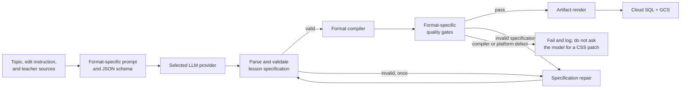

# Lesson Output and Layout Architecture

> Last reviewed: 2026-08-30
> Status: implementation in progress; the first structured Slides vertical slice is active
> Scope: newly generated Slides, Interactive, and Video lessons

## 1. Decision summary

Chalksmith will not solve layout quality by continuing to add CSS instructions, overlap warnings,
or repair rules to prompts that still ask the model for an arbitrary complete document. Each lesson
format needs a format-native output contract and a deterministic platform compiler:

| Format | Model output | Platform output |
| :--- | :--- | :--- |
| Slides | Declarative slide kinds and blocks, with a bounded custom-html escape hatch | Reveal.js HTML with compiler-selected block layouts |
| Interactive | Declarative controls/content plus restricted p5 sketch logic | Standalone interactive HTML compiled from a fixed application shell |
| Video | Declarative storyboard, objects, and animation actions | Manim source generated by a platform compiler, then rendered to MP4 |

The model decides what to teach and which approved semantic blocks express it. Chalksmith
owns page structure, typography, spacing, safe areas, responsive scaling, component rendering, and
artifact assembly. Generated text and behavior remain untrusted input throughout the pipeline.

The normal path uses one LLM call and one deterministic compile. A second LLM call is allowed only
when the returned specification is invalid; it repairs the specification, not generated CSS or
pixel coordinates.

### 1.1 Implementation status

Implemented through 2026-08-30:

- the strict `chalksmith.slides.v1` specification and provider-neutral JSON prompt;
- a deterministic Slides compiler with versioned embedded runtime CSS;
- initial statement, bullets, callout, equation, steps, comparison, fraction, and process blocks;
- an LLM-facing Block Catalog plus number-line, bar-model, bar-chart, coordinate-plot,
  geometry-model, labeled-diagram, cycle, timeline, pyramid-diagram, hierarchy-tree, and
  flow-diagram visual primitives;
- general Venn, cause/effect, strata, network, quadrant, spectrum, containment, and matrix diagrams,
  plus subject-owned math, physics, chemistry, and biology visual primitives, with reusable
  generation and visual-QA topics documented in [DIAGRAMS.md](DIAGRAMS.md);
- a bounded `custom-html` Block for one-off representations absent from the Catalog, limited to
  five slides per lesson and sanitized and scoped before compilation;
- version metadata and canonical specification persistence with additive database migration;
- bounded specification repair and specification-based lesson edits;
- a shared 16:9 frontend preview viewport;
- compiler, generation, editing, migration, and compatibility regression coverage.

Still pending:

- per-generation browser overflow checks and block-composition screenshot regression infrastructure;
- Interactive specifications, runtime, JavaScript parser, and isolated browser validation;
- Video storyboard specifications and the Manim compiler.

## 2. Goals and non-goals

### 2.1 Goals

- Make lessons from different providers look like one product.
- Prevent layout overlap and clipping by construction instead of detecting most problems after
  arbitrary HTML or Python has already been generated.
- Preserve enough variation for different STEM teaching needs without allowing unrestricted layout.
- Keep generated artifacts standalone, exportable, versioned, and reproducible.
- Use a single model request in the successful path to control latency and token cost.
- Preserve the current tenant, storage, CSP, and isolated-renderer security boundaries.
- Make adding a layout or teaching primitive an explicit product change with fixtures and tests.

### 2.2 Non-goals

- Do not expose the website's Tailwind classes to generated lessons. The lesson iframe is a separate
  document, and exported lessons cannot depend on the frontend build.
- Do not send the complete design-system CSS in every prompt.
- Do not let the model emit global CSS, page-level HTML, Reveal configuration, or Manim positioning
  code. Slides permits markup only inside the bounded and sanitized `custom-html` Block.
- Do not use screenshot criticism as the primary layout engine. Visual validation is a final quality
  gate and regression tool.
- Do not migrate existing artifacts in place. Existing lessons remain readable with their original
  source and runtime behavior.

## 3. Design principles

### 3.1 Separate instructional decisions from rendering decisions

The model owns:

- learning goal, explanation sequence, examples, checks, and recap;
- the slide kind and approved semantic blocks that best represent each teaching step;
- semantic content such as labels, equations, control definitions, geometry, datasets, and actions;
- format-specific behavior that cannot be expressed as static content.
- self-contained markup for a Slides representation only when no semantic Block expresses it.

The platform owns:

- document, slide, and component structure outside a `custom-html` Block;
- colors, typography, spacing, borders, and elevations;
- the 16:9 viewport and safe areas;
- layout algorithms, scaling, overflow rules, and z-index policy;
- asset loading, sanitization, validation, compilation, and export.

### 3.2 Prefer bounded variation

Each format starts with a bounded semantic vocabulary. Slides composes typed blocks without exposing
layout names to the model; formats with a stable application shell or scene pattern may still use
platform-owned template enums. New primitives are added only for recurring teaching needs.

### 3.3 Compile rather than patch

Compilers either produce a valid artifact from a valid specification or return structured errors.
They must not silently reduce font sizes until content fits, reposition individual elements with
one-off offsets, or append generated CSS corrections. If content exceeds the selected blocks'
capacity, the specification is invalid and must be shortened, split, or reorganized.

### 3.4 Version every contract

The specification schema, block vocabulary or template set, runtime, and compiler are versioned independently. A lesson
records the versions used to create it, and its saved artifact embeds everything required to render.
Later design-system changes do not silently alter existing lessons.

## 4. Target generation pipeline



`GenerationService` remains the workflow owner, but delegates the middle of the pipeline through a
format strategy rather than treating every model response as source code:

```python
class LessonFormatStrategy(Protocol):
    def build_prompt(self, request: LessonRequest) -> str: ...
    def parse_spec(self, response: str) -> LessonSpec: ...
    def compile(self, spec: LessonSpec, workdir: Path) -> CompiledLesson: ...
    async def validate(self, compiled: CompiledLesson) -> ValidationReport: ...
    async def render(self, compiled: CompiledLesson, workdir: Path) -> RenderedAsset: ...
```

The concrete strategies are `SlidesStrategy`, `InteractiveStrategy`, and `VideoStrategy`. Provider
adapters may use native structured-output support where available, but Pydantic validation in the
application remains authoritative so all providers have identical behavior.

## 5. Common lesson envelope

Every model response is one JSON object. The current teacher summary and the format payload are
returned together so the parser no longer has to infer where arbitrary source code ends.

```json
{
  "schema_version": "chalksmith.lesson.v1",
  "format": "slides",
  "summary": "Teacher-facing summary of the lesson.",
  "title": "Equivalent Fractions",
  "learning_goal": "Explain why two fractions can name the same quantity.",
  "grade_band": "elementary",
  "payload": {}
}
```

Common validation rules:

- `format` must match the request.
- All user-visible strings are plain text or explicitly typed mathematics except the validated
  markup inside a Slides `custom-html` Block; raw HTML anywhere else is rejected.
- Identifiers are generated or normalized by the application, not copied into selectors.
- Arrays and strings have explicit size limits.
- Unknown keys are rejected so provider mistakes are visible instead of being ignored.
- Teacher sources influence facts and examples but cannot change schema, security, or output rules.
- A lesson edit receives the previous specification, not compiler-produced HTML or Python.

Normal generation gets one specification-repair attempt for schema or content-capacity failures.
The repair prompt contains the original request, previous specification, and machine-readable error
paths such as `payload.slides[3].body: exceeds 360 characters`.

## 6. Canonical lesson viewport and design system

### 6.1 One authored coordinate system

All three formats target a canonical 16:9 stage. HTML lessons use a logical 1280 by 720 viewport;
Manim uses its corresponding 16:9 scene coordinates. The preview component preserves that ratio and
letterboxes when its available panel has a different shape.

The frontend should introduce a reusable `LessonViewport` around iframe and video previews instead
of stretching them to both the panel width and height. Full-screen and exported lessons use the same
ratio, so preview layout matches the final artifact.

Interactive and Slides artifacts scale the complete authored stage uniformly to the host container.
They do not reflow into a different composition at narrow preview widths. This is intentional:
these are classroom teaching surfaces, not general-purpose web pages. Text remains within tested
content budgets, and browser-native controls retain their behavior under the transform.

### 6.2 Runtime-owned styles

The HTML compilers embed a versioned runtime containing:

- a reset with predictable box sizing and margins;
- Chalkboard Dark design tokens;
- classroom typography and contrast rules;
- safe-area, grid, card, control, feedback, and navigation components;
- Reveal-specific overrides for Slides;
- interactive shell, control, readout, and canvas-stage rules;
- reduced-motion behavior and visible keyboard focus.

Runtime assets live with the format that consumes them:

```text
backend/app/lessons/formats/
├── slides/assets/v1/
│   ├── core.css
│   └── blocks/
│       ├── content.css
│       ├── data.css
│       ├── diagrams.css
│       ├── math.css
│       ├── physics.css
│       ├── chemistry.css
│       ├── biology.css
│       ├── custom.css
│       └── comprehension.css
├── interactive/assets/             # Added with the structured Interactive compiler
└── video/assets/                   # Added only when the Video compiler needs owned assets
```

The Slides compiler always inlines `core.css`, then adds only the deterministic Block style groups
required by the validated Spec. Group order is fixed by the compiler, so identical Specs produce
identical asset order regardless of Block order. KaTeX CSS and scripts are added only when an
`equation` Block is present. This works with the existing CSP, avoids a new public CDN dependency,
keeps saved artifacts smaller, and makes exports reproducible. The model receives only a compact
description of available blocks, fields, and behavior APIs—not CSS.

## 7. Slides output scheme

### 7.1 Why Slides are declarative

Slides have a mostly finite visual grammar: title, explanation, comparison, diagram, worked example,
question, and recap. Asking the model to write arbitrary Reveal HTML and CSS creates variation
without adding teaching capability. The model therefore returns semantic Blocks by default, while
`custom-html` covers a one-off teaching representation the Catalog cannot express. The platform
still constructs every `<section>`, chooses page composition, and initializes Reveal.

### 7.2 Slides specification

```json
{
  "slides": [
    {
      "kind": "learning-goal",
      "title": "Equivalent Fractions",
      "body": [
        {"type": "statement", "text": "Two fractions can name the same part of a whole."}
      ]
    },
    {
      "kind": "visual-explanation",
      "title": "The same amount, divided differently",
      "body": [
        {"type": "fraction-model", "numerator": 1, "denominator": 2},
        {"type": "fraction-model", "numerator": 2, "denominator": 4}
      ]
    },
    {
      "kind": "comprehension-check",
      "title": "Your turn",
      "question": "Which fraction is equivalent to 3/4?",
      "choices": ["4/5", "6/8", "6/7"],
      "answer_index": 1,
      "explanation": "Multiplying numerator and denominator by 2 gives 6/8."
    }
  ]
}
```

The v1 slide block vocabulary currently covers:

- text and symbolic teaching: `statement`, `bullets`, `callout`, `equation`, and `steps`;
- visual quantities and plots: `fraction-model`, `number-line`, `bar-model`, `bar-chart`, and
  `coordinate-plot`;
- visual models and relationships: `geometry-model`, `labeled-diagram`, `cycle`, `timeline`,
  `pyramid-diagram`, `hierarchy-tree`, `flow-diagram`, `venn-diagram`, `cause-effect-diagram`,
  `layer-diagram`, `network-diagram`, `quadrant-diagram`, and `spectrum-diagram`;
- nested and categorical relationships: `concentric-diagram` and `matrix-diagram`;
- subject-specific visuals: `function-graph`, `force-diagram`, `wave-diagram`, `particle-diagram`,
  `reaction-diagram`, and `cell-diagram`;
- structured relationships: `comparison` and `process`;
- a bounded escape hatch: `custom-html`.

Only `custom-html` has a raw markup field. It accepts allowlisted HTML, CSS, and inline SVG and may
appear on at most five slides in a lesson. The sanitizer
rejects executable or remote content, bounds markup size and complexity, strips unsupported layout
properties, and scopes classes, ids, selectors, and local SVG references to the owning Block.
JavaScript and Reveal configuration are never accepted. Every other visual Block uses normalized
semantic data rendered by platform components. A recurring visualization should become a typed
Block instead of being repeatedly implemented through the escape hatch.

Relationship diagrams use bounded semantic structures rather than model-authored coordinates:
`pyramid-diagram` receives top-to-bottom levels, `hierarchy-tree` receives a root and grouped
branches, `flow-diagram` receives connected stages, and the additional relationship Blocks receive
bounded sets, cause groups, strata, semantic network layers, quadrant regions, or ordered spectrum
bands. The runtime derives widths, connectors, colors, arrows, axes, and collision-resistant
placement. The complete capability matrix and the important semantic distinctions between Blocks
are maintained in [DIAGRAMS.md](DIAGRAMS.md).

`geometry-model` follows the same semantic boundary. The model selects a supported shape and
triangle subtype, assigns labels to sides, assigns named points to vertices or intersections, and
declares construction segments between those anchors. The compiler owns all coordinates and draws
right-angle, congruence, diagonal, radius, median, cevian, and concurrency notation consistently;
the model never supplies SVG paths or page coordinates.

The Block Catalog is the compact model-facing visual contract. For every type it describes the
teaching purpose, deterministic rendered form, appropriate use, category, and one JSON example.
The prompt includes this catalog, the generated JSON Schema, and the custom-html sanitizer's compact
allowlist guidance, but never runtime CSS or compiler markup. It also recommends visual diversity
when the topic supports it; lesson-wide visual counts remain planning guidance rather than validator
gates, except for the five-slide custom-html limit.

### 7.3 Block vertical slices

Block behavior is organized by teaching domain rather than spread across growing Spec, Catalog,
and compiler layers. The modules under `slides/blocks/` group content, data, cross-subject diagrams,
and subject-specific math, physics, chemistry, and biology Blocks. The custom category owns the
entire bounded markup slice in `slides/blocks/custom.py`: its Pydantic contract, Prompt allowlist,
HTML/CSS/SVG sanitizer, capacity helpers, scope resolution, and renderer. Each category owns its
Pydantic Block models and validation, model-facing `BlockGuide` entries, and platform HTML
renderers. The Block models remain pure data; rendering is implemented by adjacent module-level
functions rather than model methods.

Model-response recovery is a separate ingestion concern. `slides/response.py` extracts the JSON
object, applies bounded local syntax and shape recovery, validates `SlidesLessonSpec`, and builds
the bounded second-pass repair Prompt. `slides/strategy.py` only adapts that pipeline to the shared
format strategy contract and invokes the compiler.

The top-level `slides/registry.py` aggregates those vertical slices into one definition registry and
derives the model-facing Catalog, visual capabilities, Prompt text, and render
dispatch. `blocks/__init__.py` retains an explicit Pydantic discriminated union so JSON Schema and
static type information stay inspectable, while `spec.py` contains only Slide and lesson-level
contracts and validators.

Responsibilities that depend on more than one Block remain above the slices: `compiler.py` owns
compact cross-Block composition rules together with the Slide shell and standalone Reveal document,
and the versioned files under `assets/v1/` own the visual system. `core.css` provides the Slide shell,
tokens, shared cards, accessibility, and Reveal overrides; `assets/v1/blocks/*.css` mirrors the
Registry's Block categories. The Registry derives each Block's style group from its category module,
and the compiler embeds only the groups used by that lesson. This keeps a new Block mostly local
without coupling semantic data models to one export target or duplicating global layout policy
inside individual Blocks.

### 7.4 Block-driven composition

The model selects instructional content, a `kind`, and one to three compatible blocks. It does not
select a course template, layout name, column width, position, or coordinate. The compiler derives
one internal layout from the validated block combination:

| Block composition | Compiler layout |
| :--- | :--- |
| One block | Full-width `single` |
| Two ordinary blocks | Equal `split` |
| Three ordinary blocks | Equal `thirds` |
| `steps` plus `equation` | `solution-split`, with steps given more width |
| Two blocks containing exactly one visual block | `visual-split`, with the visual given more width |
Slide kinds remain teaching semantics; except for the specialized
`comprehension-check`, they do not directly choose CSS layouts.

The `steps` renderer wraps each item's complete authored content in one grid cell so KaTeX's
generated inline spans cannot be placed beside or underneath the numbered marker. When an
`equation` shares a slide with another Block, its source expression is limited to 80 characters;
longer derivations use a full-width equation or another worked-example slide.

### 7.5 Slides compilation and validation

`SlidesCompiler`:

1. validates block compatibility and content budgets;
2. renders typed blocks into platform-owned markup and resolves the pre-sanitized custom-html scope;
3. selects an internal layout from block type and count;
4. embeds Reveal.js 4.5.0, KaTeX, and the versioned lesson CSS;
5. configures Reveal for the canonical stage and embedded preview;
6. adds progress, controls, accessibility labels, and answer-reveal behavior;
7. produces one standalone HTML document.

The shared `HTMLRenderer` does not parse or repair Reveal markup. It is a format-neutral final
boundary that verifies the document marker, rejects blocked dynamic execution and obvious
nonterminating loops, injects CSP, and writes the artifact. Because structured Slides always come
from the compiler, asset normalization would duplicate format policy and hide compiler defects.

Hard generation gates:

- slide count stays within the configured lesson range;
- every slide kind satisfies its title, text, list, and visual capacity;
- equations parse and currency is not misclassified as mathematics;
- equations paired with another Block stay within the 80-character partial-width budget;
- no slide contains unknown Blocks or raw markup outside `custom-html`;
- no lesson uses `custom-html` on more than five slides;
- custom markup satisfies its element, attribute, CSS, URL, size, depth, and node allowlists;
- compiled slides do not create scroll containers.

Because the page shell, semantic Block markup, and runtime CSS are deterministic, block-composition
screenshots belong in CI. Custom-html adds bounded per-lesson variation and therefore belongs in the
same browser overflow and console checks. Per-generation browser validation is a safety net for
unusual text, mathematics, and custom representations, not a mechanism for redesigning slides.

## 8. Interactive output scheme

### 8.1 Why Interactive needs a controlled application shell

An Interactive combines two different concerns:

- the stable teaching UI: title, instructions, controls, units, readouts, feedback, and reset;
- the topic-specific simulation: p5 drawing, state updates, and pointer interaction.

The platform should own the first concern completely. The model should never create controls with
DOM APIs or position them over the canvas. It supplies control declarations and restricted sketch
logic that runs inside the prepared stage.

### 8.2 Interactive specification

```json
{
  "template": "simulation-sidebar",
  "instructions": "Change the angle and observe how the reflected ray moves.",
  "controls": [
    {
      "id": "incident_angle",
      "type": "range",
      "label": "Incident angle",
      "unit": "degrees",
      "minimum": 0,
      "maximum": 80,
      "step": 1,
      "initial": 35
    }
  ],
  "readouts": [
    {"id": "reflected_angle", "label": "Reflected angle", "unit": "degrees"}
  ],
  "feedback": {
    "prompt": "What relationship do you notice?",
    "success_condition": {
      "type": "approximately-equal",
      "left_readout": "reflected_angle",
      "right_control": "incident_angle",
      "tolerance": 1
    }
  },
  "sketch_source": "function setupLesson(p, api) { ... }\nfunction drawLesson(p, api) { ... }"
}
```

All visible control markup is generated from the typed specification. `sketch_source` is the only
model-authored executable field in the HTML formats and follows a narrow API contract:

- p5 is available only through the `p` argument in instance mode;
- control values are read through `api.getValue(id)`;
- readouts are updated through `api.setReadout(id, value)`;
- the stage dimensions and coordinate conversion come from the runtime;
- reset, keyboard focus, units, labels, and feedback rendering are platform-owned;
- `window`, `document`, `globalThis`, network APIs, storage, timers, dynamic code execution, DOM
  creation, and style mutation are forbidden.

The source is parsed before artifact assembly. Identifier and call allowlists must be enforced with
a real JavaScript parser; regex remains only a defense-in-depth check for obvious hazards. This is
an implementation dependency that requires review before installation.

### 8.3 Interactive templates

| Template | Layout | Use |
| :--- | :--- | :--- |
| `simulation-sidebar` | Large stage plus right control rail | Most parameterized models |
| `simulation-bottom-controls` | Wide stage above compact controls | Timelines, graphs, and wide scenes |
| `comparison-lab` | Two synchronized stage regions plus shared controls | Compare strategies or conditions |
| `guided-investigation` | Stage, compact controls, and question/feedback sequence | Prediction and inquiry activities |

The compiler chooses fixed slot sizes and safe areas for each template. The model does not specify
CSS grid tracks, absolute positions, or z-index values.

### 8.4 Interactive runtime

`InteractiveCompiler` generates:

- semantic control and readout markup from the specification;
- one p5 canvas host confined to the stage slot;
- a state registry and validated control bindings;
- a `ResizeObserver` owned by the runtime;
- one reset path that restores every declared initial value;
- pointer-coordinate mapping owned by the runtime;
- error containment that replaces a failed sketch with a useful lesson error instead of freezing
  the surrounding generation page.

The sketch draws against logical stage coordinates. The runtime owns scaling between the logical
stage and the displayed 16:9 lesson viewport, so individual lessons do not implement competing
canvas scale formulas.

### 8.5 Interactive validation

Hard generation gates:

- every referenced control and readout ID is declared exactly once;
- control ranges, steps, initial values, labels, and units are valid;
- control and instruction counts fit the selected template;
- sketch source passes syntax, identifier, call, and loop validation;
- no DOM, CSS, network, storage, or dynamic execution API is reachable;
- setup and several bounded draw/update frames complete without console errors;
- controls change simulation state and reset returns to the declared initial state.

Generated JavaScript must never execute in the public API process. Runtime smoke testing belongs in
an isolated private browser-renderer service with no database, storage, LLM, or secret access. The
existing sandboxed iframe and restrictive CSP remain required in the final artifact.

## 9. Video output scheme

### 9.1 Why Video needs a storyboard compiler

Video has no CSS layout, and its quality problems are temporal as well as spatial. A complete
model-authored Manim scene can place objects anywhere, keep too many objects visible, animate faster
than students can follow, or fail late in rendering. Prompt warnings cannot reliably coordinate all
frames.

The model should instead describe a storyboard using teaching beats, semantic objects, layout slots,
and animation actions. A platform-owned compiler turns that storyboard into the only Python source
the renderer executes.

### 9.2 Video specification

As an incremental step before the storyboard compiler owns the complete scene, the current
code-driven Video strategy injects a versioned platform runtime into generated Manim source. That
runtime owns the chalkboard palette, Inter/Noto CJK typography roles, background, text fitting, and
the approved `MathTex` template. Model-authored code must use `cs_text` and `cs_math`; direct text
objects and background overrides are rejected and receive the existing bounded repair pass. Main
display and derivation equations share one base font size, while compact math is reserved for
diagram annotations. An expression that would need more than ten percent downscaling is rejected so
the repair pass can split it into multiple consistently sized formula objects.

```json
{
  "template": "worked-explanation",
  "target_duration_seconds": 70,
  "beats": [
    {
      "kind": "opening",
      "narration": "A triangle's angles always add to 180 degrees.",
      "objects": [
        {"id": "triangle", "type": "triangle", "slot": "main-visual"},
        {"id": "claim", "type": "text", "text": "A + B + C = 180°", "slot": "key-idea"}
      ],
      "actions": [
        {"type": "create", "target": "triangle", "duration": 1.2},
        {"type": "write", "target": "claim", "duration": 1.0}
      ]
    }
  ]
}
```

The v1 object vocabulary should include:

- text, label, callout, validated LaTeX equation, and step list;
- line, arrow, point, circle, rectangle, polygon, angle, brace, and measurement;
- axes, number line, plotted points, and sampled function graphs;
- groups whose children use compiler-controlled arrangement.

The v1 action vocabulary should include:

- create, write, fade-in, fade-out, highlight, move-to-slot, transform, indicate, and wait;
- replace-step and clear-region operations that keep simultaneous object count bounded.

There is no raw Python field. Geometry coordinates are local to a visual object and normalized
inside its assigned slot. Page-level placement uses named slots rather than Manim coordinates.

### 9.3 Video templates and layout

| Template | Use |
| :--- | :--- |
| `concept-explainer` | Introduce one visual relationship and build it in stages |
| `worked-explanation` | Present a problem and reveal a checked solution step by step |
| `compare-processes` | Contrast two methods or systems over synchronized beats |
| `geometry-proof` | Build a diagram, mark known facts, and connect proof steps |
| `graph-story` | Introduce axes, plot a relationship, and interpret changes |

`VideoCompiler` owns scene constants, title and caption safe areas, named layout slots, group
arrangement, text wrapping, object fitting, transitions, and cleanup. It uses `VGroup.arrange`,
bounded scaling, and deterministic z-order internally; these details are never prompt vocabulary.

### 9.4 Video compilation and validation

Before rendering, the compiler validates:

- beat sequence, object references, slot capacity, and action compatibility;
- configured duration, per-beat reading time, and bounded simultaneous object count;
- local geometry bounds and text-length budgets;
- every object entering or leaving the scene through a declared action;
- no unsupported primitive, transition, font, image, SVG, LaTeX package/template, or external asset.

The compiler then emits a `GeneratedScene` using only audited platform helpers. The private Manim
renderer retains its deadline, output-size limit, and lack of application credentials. Sampled
render frames are checked for safe-area violations and unexpected blank frames; failures are
reported against storyboard paths, not repaired with hand-authored coordinates.

Once this path is complete, the model no longer emits Python. That reduces both layout variability
and the generated-code attack surface.

## 10. Quality gates and retry policy

Quality gates are format-specific and ordered from cheapest to most expensive:

| Stage | Slides | Interactive | Video |
| :--- | :--- | :--- | :--- |
| Schema | Typed blocks and content budgets | Typed UI plus sketch contract | Typed storyboard and actions |
| Static compile | Deterministic DOM | Deterministic DOM plus JS AST checks | Deterministic Manim source |
| Runtime | Reveal/KaTeX layout smoke test | Controls, reset, and bounded frames | Isolated Manim render |
| Visual | Template regression plus overflow check | Stage/controls safe areas and screenshot | Sampled frames and safe areas |

Retry rules:

1. Invalid JSON, schema, references, or content capacity gets one specification-repair call.
2. A repaired specification is parsed and compiled from the beginning.
3. A platform template, compiler, or runtime failure is not sent to the model as a request for
   arbitrary code changes; generation fails with a stable public error and detailed internal log.
4. Runtime failures caused by model-authored Interactive logic may receive one repair attempt that
   changes `sketch_source` or its declarations but cannot change the application shell or CSS.
5. Video render failures caused by invalid storyboard semantics may repair the storyboard. A crash
   in compiler-produced Python is a platform defect.

This policy keeps repair aligned with ownership: the model repairs model-owned data, and developers
repair platform-owned rendering code.

## 11. Persistence, revisions, and compatibility

The `Lesson` row should gain additive fields:

| Field | Purpose |
| :--- | :--- |
| `spec_version` | Top-level specification contract used by the lesson |
| `runtime_version` | Embedded HTML or Manim compiler/runtime version |
| `compiler_version` | Deterministic compiler implementation used for derived source |
| `lesson_spec` | Canonical validated JSON specification |

`source_code` remains populated with compiler-produced HTML or Python for code view, export support,
and debugging. It is derived output, not the canonical edit input. Existing rows with no
`lesson_spec` remain readable from their persisted source and artifact but are not valid edit bases.

Edits use the prior `lesson_spec` and preserve validated teaching content unless the instruction
requires a different kind or block composition. Every revision remains a new lesson row under the
existing root/parent/version model.

The additive SQLModel migration must update existing databases without rewriting old rows. API
responses can add the new metadata as optional fields while retaining the current `source_code`
contract.

## 12. Proposed repository changes

```text
backend/app/
├── lessons/
│   ├── generation.py                 # Delegate to a format strategy
│   ├── sources.py                    # Teacher source extraction
│   ├── formats/
│   │   ├── contracts.py              # Shared requests, results, strategy, and spec base
│   │   ├── code.py                   # Code-format strategy and prompt envelope
│   │   ├── registry.py               # Format selection
│   │   ├── slides/                   # Prompt, spec, compiler, and runtime assets
│   │   ├── interactive/              # Interactive strategy and prompt
│   │   └── video/                    # Video strategy and prompt
│   └── render/
│       ├── html.py                   # Secure compiled HTML artifacts
│       └── manim.py                  # Render compiler-produced scenes
└── db/models.py                      # Specification/runtime metadata

frontend/src/components/generation/
└── LessonViewport.tsx                # Canonical 16:9 preview surface

backend/tests/
├── fixtures/lesson_specs/            # Valid and invalid format fixtures
├── fixtures/golden/                  # Compiler snapshots and expected metadata
└── existing test modules             # Pipeline, security, and API coverage
```

If per-generation Interactive browser validation is adopted, it should be a separately deployed
private service or image so Chromium and generated JavaScript do not enter the public API container.
Its client belongs behind a renderer protocol just like the current remote Manim renderer.

## 13. Implementation plan

### Phase 1: Contracts and common infrastructure

- Define the common envelope and three Pydantic specification models.
- Add the format strategy protocol and registry.
- Add specification/runtime metadata to `Lesson` with an additive migration.
- Preserve the legacy parser and renderers only for formats that still generate code; persisted
  Slides without a specification are display-only.
- Add `LessonViewport` and make every preview use the canonical aspect ratio.
- Create representative fixture specifications before writing compilers.

Exit criteria: every fixture is accepted or rejected at the intended schema path; existing lesson
tests and previews remain compatible.

### Phase 2: Slides compiler

- Implement typed slide blocks, compatibility rules, and content-capacity rules.
- Implement platform visual components for the v1 block vocabulary.
- Compile standalone Reveal/KaTeX HTML with the embedded v1 runtime.
- Add block-composition screenshot fixtures and overflow checks.
- Route all new Slides generation through `SlidesStrategy`; do not retain a legacy Slides Prompt.

Slides goes first because it proves the specification, compiler, persistence, and rollout pattern
without model-authored executable code.

### Phase 3: Interactive compiler and runtime

- Implement control, readout, feedback, and template schemas.
- Build the deterministic interactive shell and runtime state API.
- Select and approve a JavaScript parser for sketch validation.
- Implement p5 instance-mode wrapping, stage scaling, pointer mapping, reset, and error containment.
- Add isolated runtime smoke validation before an artifact becomes `ready`.
- Route new Interactive generation through `InteractiveStrategy` behind its own feature flag.

### Phase 4: Video storyboard compiler

- Implement storyboard, object, action, slot, and duration schemas.
- Build audited Manim primitives, layouts, transitions, and cleanup helpers.
- Generate `GeneratedScene` exclusively from the validated storyboard.
- Add compile-time scene bounds plus sampled-frame validation.
- Route new Video generation through `VideoStrategy`; retire model-authored Python for new lessons.

### Phase 5: Evaluation and default rollout

- Build a benchmark set spanning elementary and middle-school mathematics, physical science, life
  science, engineering, text-heavy topics, equations, and source-backed lessons.
- Generate every benchmark repeatedly with each supported provider.
- Record schema success, retry rate, generation latency, artifact success, runtime errors, overflow,
  safe-area violations, and human teaching-quality review.
- Enable one format at a time by default only after it meets the acceptance criteria below.
- Keep legacy rows readable; remove legacy generation per format after the new path is stable across
  all configured providers. Slides has already reached this state and its historical rows are read-only.

## 14. Acceptance criteria

The architecture is complete when:

- newly generated lessons contain no model-authored global CSS or page layout markup;
- Slides contain no model-authored JavaScript, Reveal configuration, global CSS, or page-level
  markup; custom-html content remains isolated, allowlisted, bounded, and scoped;
- Interactive controls, units, instructions, readouts, reset, and feedback are platform-rendered;
- Interactive sketch logic cannot access DOM, CSS, network, storage, or dynamic execution APIs;
- Video contains no model-authored Python and every visible object comes from an audited primitive;
- the generation preview, full-screen lesson, and exported artifact share the same 16:9 composition;
- no accepted benchmark artifact has unintended scrollbars, clipped primary content, or safe-area
  violations at the canonical viewport;
- edits preserve their validated specification and runtime lineage;
- one successful generation requires one LLM call; retries are measurable and bounded;
- old lessons continue to load and export without being recompiled.

## 15. Decisions to keep explicit

- **No universal output language:** Slides, Interactive, and Video use different specifications
  because their rendering and failure modes are different.
- **Bounded Slides escape hatch:** `custom-html` is for one-off teaching representations only; it is
  limited to five slides, sanitized, and scoped. Recurring capability becomes a typed
  primitive or format-owned composition rule.
- **No frontend styling dependency:** lesson artifacts own their embedded, versioned runtime.
- **No responsive recomposition:** a stable 16:9 teaching stage scales uniformly.
- **No LLM visual patch loop:** deterministic compilers own layout; model retries repair only semantic
  specifications and Interactive sketch behavior.
- **No big-bang migration:** rollout remains isolated by format, while persisted version metadata
  makes old and new artifacts coexist predictably without retaining obsolete generation Prompts.
